```{r setup, include=FALSE}
knitr::opts_chunk$set(echo = TRUE)
```

<style>
p.caption {
  font-size: 1.5em;
}
</style>

```{css, echo=F}
pre code, pre, code {
  white-space: pre !important;
  overflow-x: scroll !important;
  word-break: keep-all !important;
  word-wrap: initial !important;
}
```

***

This documents an MDD TWAS study. The analysis was carried out by Lorenza Dall'Aglio and Oliver Pain, with supervision from Cathryn Lewis.

This study used GWAS summary statistics from the Wray et al Major Depression GWAS, including 23andMe participants. We used SNP-weights derived by FUSION for brain tissues, HPA tissues, HPT tissues, and blood. 

We also included SNP-weights derived by the PsychENCODE team for the DLPFC. The PsychENCODE SNP-weights were derived using all HRC imputed variants within the PsychENCODE dataset. The standard FUSION LD reference is restricted to HapMap3 variants, so when using the PsychENCODE SNP-weight we used an unrestricted version of the 1KG Phase 3 reference to improve SNP overlap.

***

# Estimating transcriptome-wide significance threshold

First we need to estimate our transcriptome-wide significance threshold to account for the number of features tested. We will use a permutation-based approach to determine the appropriate transcriptome-wide significance threshold. It works by performing TWAS using the relevent SNP-weight panels.

<details><summary>Show a list of SNP-weight panels in the TWAS</summary>
```{R, echo=F}
panels<-read.table('/users/k1806347/brc_scratch/Analyses/Lorenza/Clean/TWASweights_list_withPsychENCODE.txt')
names(panels)<-'Panel'

library(knitr)
kable(panels, rownames = FALSE, caption='SNP-weight panels used in MDD TWAS')
```
</details>

<details><summary>Generate null distribution</summary>
```{bash, echo=T, eval=F}
mkdir -p /users/k1806347/brc_scratch/Analyses/Lorenza/Clean/EstTWSig

for batch in $(seq 1 20); do
sbatch -p brc,shared -n 1 --mem=10G /users/k1806347/brc_scratch/Software/Rscript.sh /users/k1806347/brc_scratch/Analyses/Lorenza/Clean/EstTWSig/TWASPermuThr.R \
--nperm 50 \
--ncore 1 \
--weights /users/k1806347/brc_scratch/Analyses/Lorenza/Clean/TWASweights_list_withPsychENCODE.txt \
--output /users/k1806347/brc_scratch/Analyses/Lorenza/Clean/EstTWSig/Batch${batch}
done
```
</details>

<details><summary>Estimate transcriptome-wide significance threshold</summary>
```{R, echo=T, eval=F}
library(data.table)
library(MKmisc)

# Create list of files containing minimum p values
batches<-list.files(path='/users/k1806347/brc_scratch/Analyses/Lorenza/Clean/EstTWSig/',pattern='Batch*')

# Combine all the minimum p-values
min_P_all<-NULL
for(batch in batches){		
	min_P_all<-c(min_P_all,fread(paste0('/users/k1806347/brc_scratch/Analyses/Lorenza/Clean/EstTWSig/',batch), header=F)$V1)
}

# Calculate the 5th percentile of the minimum p-values
TWalpha<-MKmisc::quantileCI(x=min_P_all, prob=0.05, method="exact",conf.level=0.95)
TWalpha # 1.368572e-06

# Calculate the 0.1th percentile which will be needed for the high-confidence associations section
TWalpha_001<-MKmisc::quantileCI(x=min_P_all, prob=0.001, method="exact",conf.level=0.99)
TWalpha_001 # 3.685926e-08

# Save the R object for future reference
saveRDS(TWalpha,file='/users/k1806347/brc_scratch/Analyses/Lorenza/Clean/EstTWSig/TWASsign_05.RDS')
saveRDS(TWalpha_001,file='/users/k1806347/brc_scratch/Analyses/Lorenza/Clean/EstTWSig/TWASsign_001.RDS')

```
</details>

***

# TWAS

***

## FUSION SNP-weights

***

### GWAS summary statistics preparation

GWAS summary statistics were munged using the LDSC munge_sumstats.py.

<details><summary>Show munge log file</summary>
```{bash, echo=F}
cat /users/k1806347/brc_scratch/Analyses/Lorenza/Clean/DEPR01.log
```
</details>

Then, I modified the sumstats to remove the rows with missing values.

<details><summary>Show code</summary>
```{bash, echo=T, eval=F}
module add general/R/3.5.0
R

library(data.table)

# Read in the LDSC munged sumstats using zcat to unzip the file
sumstats<-data.frame(fread('zcat /mnt/lustre/groups/ukbiobank/sumstats/munged/DEPR01.sumstats.gz'))

# Remove rows containing NA values
sumstats<-sumstats[complete.cases(sumstats),]

# Save the reformatted sumstats and compress
write.table(sumstats, '/users/k1806347/brc_scratch/Data/GWAS_sumstats/DEPR01.sumstats.noNA', col.names=T, row.names=F,quote=F)

q()
n

gzip /users/k1806347/brc_scratch/Data/GWAS_sumstats/DEPR01.sumstats.noNA

```
</details>

***

### TWAS analysis

<details><summary>Run TWAS</summary>
```{bash, eval=F, echo=T}
# Run analysis for each chromomsome and each panel
for chr in $(seq 1 22); do
  for weights in Adrenal_Gland Brain_Amygdala Brain_Anterior_cingulate_cortex_BA24 Brain_Caudate_basal_ganglia Brain_Cerebellar_Hemisphere Brain_Cerebellum Brain_Cortex Brain_Frontal_Cortex_BA9 Brain_Hippocampus Brain_Hypothalamus Brain_Nucleus_accumbens_basal_ganglia Brain_Putamen_basal_ganglia Brain_Substantia_nigra CMC.BRAIN.RNASEQ CMC.BRAIN.RNASEQ_SPLICING NTR.BLOOD.RNAARR Pituitary Thyroid Whole_Blood YFS.BLOOD.RNAARR; do
    qsub -cwd /mnt/lustre/users/k1894478/scripts/Rscript_correct.sh /mnt/lustre/groups/biomarkers-brc-mh/TWAS_resource/FUSION/fusion_twas-master/FUSION.assoc_test.R \
      --sumstats /users/k1806347/brc_scratch/Data/GWAS_sumstats/DEPR01.sumstats.noNA.gz \
      --weights /mnt/lustre/groups/biomarkers-brc-mh/TWAS_resource/FUSION/SNP-weights/${weights}/${weights}.pos \
      --weights_dir /mnt/lustre/groups/biomarkers-brc-mh/TWAS_resource/FUSION/SNP-weights/${weights} \
      --ref_ld_chr /mnt/lustre/groups/biomarkers-brc-mh/TWAS_resource/FUSION/LDREF/1000G.EUR. \
      --out /mnt/lustre/users/k1894478/output_correct/wray_output/test.${weights}.chr${chr} \
      --chr ${chr} \
      --coloc_P 4.432625e-06 \
      --GWASN 480359
  done
done

# Check each chromosome finished
for weights in Adrenal_Gland Brain_Amygdala Brain_Anterior_cingulate_cortex_BA24 Brain_Caudate_basal_ganglia Brain_Cerebellar_Hemisphere Brain_Cerebellum Brain_Cortex Brain_Frontal_Cortex_BA9 Brain_Hippocampus Brain_Hypothalamus Brain_Nucleus_accumbens_basal_ganglia Brain_Putamen_basal_ganglia Brain_Substantia_nigra CMC.BRAIN.RNASEQ CMC.BRAIN.RNASEQ_SPLICING NTR.BLOOD.RNAARR Pituitary Thyroid Whole_Blood YFS.BLOOD.RNAARR; do
echo $weights
ls /mnt/lustre/users/k1894478/output_correct/wray_output/test.${weights}.chr* | wc -l  #this tells you how many files there are with the name test.X.chrX
done

# To combine per chromosome results file, without duplicating the header
for weights in Adrenal_Gland Brain_Amygdala Brain_Anterior_cingulate_cortex_BA24 Brain_Caudate_basal_ganglia Brain_Cerebellar_Hemisphere Brain_Cerebellum Brain_Cortex Brain_Frontal_Cortex_BA9 Brain_Hippocampus Brain_Hypothalamus Brain_Nucleus_accumbens_basal_ganglia Brain_Putamen_basal_ganglia Brain_Substantia_nigra CMC.BRAIN.RNASEQ CMC.BRAIN.RNASEQ_SPLICING NTR.BLOOD.RNAARR Pituitary Thyroid Whole_Blood YFS.BLOOD.RNAARR; do
head -n 1 /mnt/lustre/users/k1894478/output_correct/wray_output/test.${weights}.chr1 > /mnt/lustre/users/k1894478/output_correct/wray_output/test.${weights}.GW      
tail -n +2 -q /mnt/lustre/users/k1894478/output_correct/wray_output/test.${weights}.chr* >> /mnt/lustre/users/k1894478/output_correct/wray_output/test.${weights}.GW    
done

# Create file containing results for all tissues
awk '
    FNR==1 && NR!=1 { while (/TWAS.P/) getline; }
    1 {print}
' /mnt/lustre/users/k1894478/output_correct/wray_output/test.*.GW >/mnt/lustre/users/k1894478/output_correct/wray_output/AllTissues.GW


# Check the .GW files which were created
ls *.GW

# Delete the per chromosome files
for chr in $(seq 1 22); do
  rm /mnt/lustre/users/k1894478/output_correct/wray_output/test.*.chr${chr}
done

rm /mnt/lustre/users/k1894478/output_correct/wray_output/test.*.chr6.MHC
```
</details>

***

## PsychENCODE SNP-weights

***

### GWAS summary statistics preparation

The PsychENCODE SNP-weights are not restricted to HapMap3 variants, so we need to use unrestricted GWAS summary statistics also. To achieve this I use the FOCUS software munge script.

<details><summary>Show code</summary>
```{bash, eval=F, echo=T}
# Edit BP column name
zcat /mnt/lustre/groups/ukbiobank/sumstats/cleaned/DEPR01.gz | sed -e 's/ORIGBP/BP/g' > /users/k1806347/brc_scratch/Data/GWAS_sumstats/Lorenza/DEPR01_BP

# Munge
/users/k1806347/brc_scratch/Software/focus.sh munge /users/k1806347/brc_scratch/Data/GWAS_sumstats/Lorenza/DEPR01_BP --output /users/k1806347/brc_scratch/Data/GWAS_sumstats/Lorenza/DEPR01.focus

# Delete temporary file
rm /users/k1806347/brc_scratch/Data/GWAS_sumstats/Lorenza/DEPR01_BP
```
</details>

<details><summary>Show munge log file</summary>
```{bash, echo=F}
cat //users/k1806347/brc_scratch/Analyses/Lorenza/Clean/DEPR01.focus.log
```
</details>

***

### TWAS analysis

<details><summary>Run TWAS</summary>
```{bash, eval=F, echo=T}
for chr in $(seq 1 22); do
  sbatch -p brc,shared --mem=20G /users/k1806347/brc_scratch/Software/Rscript.sh /scratch/groups/biomarkers-brc-mh/TWAS_resource/FUSION/fusion_twas-master/FUSION.assoc_test.R \
    --sumstats /users/k1806347/brc_scratch/Data/GWAS_sumstats/Lorenza/DEPR01.focus.sumstats.gz \
    --weights /scratch/groups/biomarkers-brc-mh/TWAS_resource/PsychEncode/PEC_TWAS_weights/PEC_TWAS_weights.pos \
    --weights_dir /scratch/groups/biomarkers-brc-mh/TWAS_resource/PsychEncode/PEC_TWAS_weights \
    --ref_ld_chr /scratch/groups/biomarkers-brc-mh/Reference_data/1KG_Phase3/PLINK/EUR/EUR_phase3.MAF_001.chr \
    --out /users/k1806347/brc_scratch/Analyses/Lorenza/PsychENCODE/MDD_TWAS_PsychENCODE.chr${chr} \
    --chr ${chr} \
    --coloc_P 4.432625e-06 \
    --GWASN 480359
done
```
</details>

<details><summary>Format to match FUSION panel results</summary>
```{R, eval=F, echo=T}
library(data.table)

psychENCODE<-NULL
for(i in 1:22){
	if(i == 6){
		tmp1<-fread(paste0('/users/k1806347/brc_scratch/Analyses/Lorenza/PsychENCODE/MDD_TWAS_PsychENCODE.chr',i))
		tmp2<-fread(paste0('/users/k1806347/brc_scratch/Analyses/Lorenza/PsychENCODE/MDD_TWAS_PsychENCODE.chr',i,'.MHC'))
		tmp<-rbind(tmp1,tmp2)
	} else {
		tmp<-fread(paste0('/users/k1806347/brc_scratch/Analyses/Lorenza/PsychENCODE/MDD_TWAS_PsychENCODE.chr',i))
	}
	
	psychENCODE<-rbind(psychENCODE, tmp)
}

col_order<-names(psychENCODE)

psychENCODE$PANEL<-as.character(psychENCODE$PANEL)
psychENCODE$PANEL<-'PsychENCODE'

library(biomaRt)
ensembl = useEnsembl(biomart="ensembl", dataset="hsapiens_gene_ensembl", GRCh=37)
listAttributes(ensembl)
Genes<-getBM(attributes=c('ensembl_gene_id','external_gene_name'), mart = ensembl)

psychENCODE<-merge(psychENCODE, Genes, by.x='ID', by.y='ensembl_gene_id')
psychENCODE$ID<-psychENCODE$external_gene_name
psychENCODE$external_gene_name<-NULL

psychENCODE<-psychENCODE[,col_order, with=F]

write.table(psychENCODE, '/users/k1806347/brc_scratch/Analyses/Lorenza/PsychENCODE/MDD_TWAS_PsychENCODE.GW', col.names=T, row.names=F, quote=F)
```
</details>

***

## Combine results across FUSION and PsychENCODE panels

<details><summary>Format to match FUSION panel results</summary>
```{R, eval=F, echo=T}
library(data.table)

psych<-fread('/users/k1806347/brc_scratch/Analyses/Lorenza/PsychENCODE/MDD_TWAS_PsychENCODE.GW')
fusion<-fread('/users/k1806347/brc_scratch/Analyses/Lorenza/AllTissues.GW')

all<-rbind(psych,fusion)

# Write out full results
write.table(all, '/users/k1806347/brc_scratch/Analyses/Lorenza/Clean/TWAS/MDD_TWAS_AllTissues.txt', row.names=F, col.names=T, quote=F)

# Write out transcriptome-wide significant results
write.table(all[which(all$TWAS.P < 1.368572e-06),], '/users/k1806347/brc_scratch/Analyses/Lorenza/Clean/TWAS/MDD_TWAS_AllTissues_TWSig.txt', row.names=F, col.names=T, quote=F)

dim(all[which(all$TWAS.P < 1.368572e-06),]) # 176 hits
length(unique(all[which(all$TWAS.P < 1.368572e-06),]$ID)) # 94 unique genes

# Check how much PsychENCODE adds
dim(fusion[which(fusion$TWAS.P < 1.368572e-06),]) # 154 hits
length(unique(fusion[which(fusion$TWAS.P < 1.368572e-06),]$ID)) # 84 unique genes
```
</details>

***

# Follow-up analyses

***

## Create Manahattan-style plots

<details><summary>Show code</summary>
```{bash, eval=F, echo=T}
# Manhattan plot based on permutation significance
/users/k1806347/brc_scratch/Software/Rscript_singularity.sh /scratch/groups/biomarkers-brc-mh/TWAS_resource/FUSION/Scripts/Git/opain/TWAS-plotter/TWAS-plotter.V1.0.r \
--twas /users/k1806347/brc_scratch/Analyses/Lorenza/Clean/TWAS/MDD_TWAS_AllTissues.txt \
--sig_p 1.368572e-06 \
--output /users/k1806347/brc_scratch/Analyses/Lorenza/Clean/TWAS/MDD_TWAS_AllTissues_Manhattan \
--width 3500 \
--height 2500

#Manhattan plot for high confidence associations
/users/k1806347/brc_scratch/Software/Rscript_singularity.sh /scratch/groups/biomarkers-brc-mh/TWAS_resource/FUSION/Scripts/Git/opain/TWAS-plotter/TWAS-plotter.V1.0.r \
--twas /users/k1806347/brc_scratch/Analyses/Lorenza/Clean/TWAS/MDD_TWAS_AllTissues.txt \
--sig_p 3.685926e-08 \
--output /users/k1806347/brc_scratch/Analyses/Lorenza/Clean/TWAS/MDD_TWAS_AllTissues_HighConf_Manhattan \
--width 3500 \
--height 2500

```
</details>

```{bash, eval=T, echo=F}
cp /users/k1806347/brc_scratch/Analyses/Lorenza/Clean/TWAS/MDD_TWAS_AllTissues_Manhattan.png /users/k1806347/brc_scratch/Software/MyGit/MDD-TWAS/Images/

cp /users/k1806347/brc_scratch/Analyses/Lorenza/Clean/TWAS/MDD_TWAS_AllTissues_HighConf_Manhattan.png /users/k1806347/brc_scratch/Software/MyGit/MDD-TWAS/Images/
```

<details><summary>Show Manhattan plots</summary>

<center>

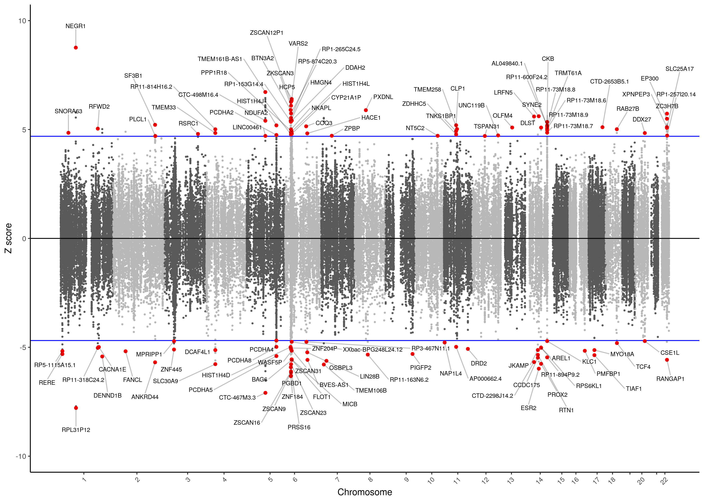

***

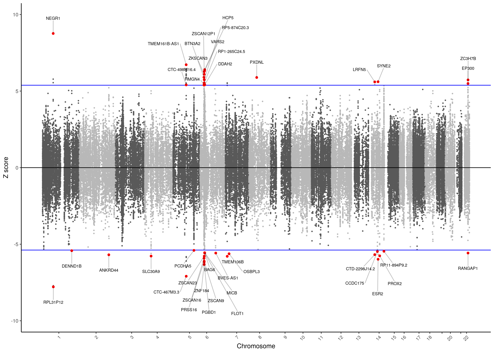

\center

</details>

***
## Conditional analysis

<details><summary>Run post_process.R script</summary>
```{bash, eval=F, echo=T}
# Change directory to location of glist-hg19 file
cd /users/k1806347/brc_scratch/Data/Gene_Locations

mkdir -p /users/k1806347/brc_scratch/Analyses/Lorenza/Clean/Conditional

for chr in $(seq 1 22); do

  status=$(awk -v var="${chr}" '$4 == var {print "Present";exit;}' /users/k1806347/brc_scratch/Analyses/Lorenza/PsychENCODE/post-TWAS/MDD_TWAS_AllTissues_TWSig.txt )
  
  if [ "$status" == "Present" ]; then
    sbatch -p brc,shared --mem 25G -n 1 /users/k1806347/brc_scratch/Software/Rscript_singularity.sh /scratch/groups/biomarkers-brc-mh/TWAS_resource/FUSION/fusion_twas-master/FUSION.post_process.R \
      --input /users/k1806347/brc_scratch/Analyses/Lorenza/Clean/TWAS/MDD_TWAS_AllTissues_TWSig.txt \
      --sumstats /users/k1806347/brc_scratch/Data/GWAS_sumstats/Lorenza/DEPR01.focus.sumstats.gz \
      --report \
      --ref_ld_chr /scratch/groups/biomarkers-brc-mh/Reference_data/1KG_Phase3/PLINK/EUR/EUR_phase3.MAF_001.chr \
      --out /users/k1806347/brc_scratch/Analyses/Lorenza/Clean/Conditional/test.cond.chr${chr} \
      --chr ${chr} \
      --plot \
      --plot_legend all \
      --save_loci \
      --locus_win 500000
  fi

done
```
</details>

***

## Process TWAS results

<details><summary>Clean the TWAS results</summary>
```{R, eval=F, echo=T}
###
# Clean file PANEL names 
###

rm(list=ls())
library(data.table)
twas_sign <- fread("/users/k1806347/brc_scratch/Analyses/Lorenza/Clean/TWAS/MDD_TWAS_AllTissues_TWSig.txt")
twas <- fread("/users/k1806347/brc_scratch/Analyses/Lorenza/Clean/TWAS/MDD_TWAS_AllTissues.txt")

dim(twas)[1] # 97733 features in PANELS
sum(!is.na(twas$TWAS.P)) # 95720 features that could be imputed in GWAS
length(unique(twas$ID)) # 22006 unique genes in PANELS
length(unique(twas$ID[!is.na(twas$TWAS.P)])) # 21507 unique gene that could be imputed in GWAS

twas_sign$BEST.GWAS.P<-2*pnorm(-abs(twas_sign$BEST.GWAS.Z))
sum(twas_sign$BEST.GWAS.P > 5e-8) # 63
sum(twas_sign$BEST.GWAS.P < 5e-8) # 113

str(twas_sign)
str(twas)

#clean the PANEL names of the output df containing results on all tested features
twas$PANEL_clean<-gsub('_',' ',twas$PANEL)
twas$PANEL_clean<-gsub('CMC.BRAIN.RNASEQ','CMC DLPFC',twas$PANEL_clean)
twas$PANEL_clean<-gsub('SPLICING','Splicing',twas$PANEL_clean)
twas$PANEL_clean<-gsub('NTR.BLOOD.RNAARR','NTR Blood',twas$PANEL_clean)
twas$PANEL_clean<-gsub('YFS.BLOOD.RNAARR','YFS Blood',twas$PANEL_clean)
twas$PANEL_clean[!grepl('CMC|NTR|YFS|PsychENCODE', twas$PANEL)]<-paste0('GTEx ',twas$PANEL_clean[!grepl('CMC|NTR|YFS|PsychENCODE', twas$PANEL)])
#to add gtex to each of the snp weights which don't have CMC NTR or YFS in front
twas$PANEL_clean<-gsub('Brain', '', twas$PANEL_clean)
twas$PANEL_clean <- gsub('Anterior cingulate cortex', 'ACC', twas$PANEL_clean)
twas$PANEL_clean <- gsub('basal ganglia', '', twas$PANEL_clean)
twas$PANEL_clean <- gsub('BA9', '', twas$PANEL_clean)
twas$PANEL_clean <- gsub('BA24', '', twas$PANEL_clean)
twas$PANEL_clean <- gsub('  ', ' ', twas$PANEL_clean)

# Create a table showing the number of features tested for each SNP-weight set
tab_ob<-table(twas$PANEL_clean)
panel_tab<-data.frame(tab_ob)
names(panel_tab)<-c('PANEL','N_feat')

tab_imp_ob<-table(twas[!is.na(twas$TWAS.P),]$PANEL_clean)
panel_imp_tab<-data.frame(tab_imp_ob)
names(panel_imp_tab)<-c('PANEL','N_feat')

panel_tab_all<-merge(panel_tab, panel_imp_tab, by='PANEL')
names(panel_tab_all)<-c('PANEL','N_feat','N_feat_imp')

write.csv(panel_tab_all, file = "/users/k1806347/brc_scratch/Analyses/Lorenza/Clean/TWAS/MDD_TWAS_Panel_N.csv", row.names = F)

# Shorten panel name to plot easily
twas$PANEL_clean_short<-substr(twas$PANEL_clean, start = 1, stop = 25)  #start the name at the first character and stop at the 25th
twas$PANEL_clean_short[nchar(twas$PANEL_clean) > 25]<-paste0(twas$PANEL_clean_short[nchar(twas$PANEL_clean) > 25], "...")

#do the same for the output file with sign features only
twas_sign$PANEL_clean<-gsub('_',' ',twas_sign$PANEL)
twas_sign$PANEL_clean<-gsub('CMC.BRAIN.RNASEQ','CMC DLPFC',twas_sign$PANEL_clean)
twas_sign$PANEL_clean<-gsub('SPLICING','Splicing',twas_sign$PANEL_clean)
twas_sign$PANEL_clean<-gsub('NTR.BLOOD.RNAARR','NTR Blood',twas_sign$PANEL_clean)
twas_sign$PANEL_clean<-gsub('YFS.BLOOD.RNAARR','YFS Blood',twas_sign$PANEL_clean)
twas_sign$PANEL_clean[!grepl('CMC|NTR|YFS|PsychENCODE', twas_sign$PANEL)]<-paste0('GTEx ',twas_sign$PANEL_clean[!grepl('CMC|NTR|YFS|PsychENCODE', twas_sign$PANEL)])
#to add gtex to each of the snp weights which don't have CMC NTR or YFS in front
twas_sign$PANEL_clean<-gsub('Brain', '', twas_sign$PANEL_clean)
twas_sign$PANEL_clean <- gsub('Anterior cingulate cortex', 'ACC', twas_sign$PANEL_clean)
twas_sign$PANEL_clean <- gsub('basal ganglia', '', twas_sign$PANEL_clean)
twas_sign$PANEL_clean <- gsub('BA9', '', twas_sign$PANEL_clean)
twas_sign$PANEL_clean <- gsub('BA24', '', twas_sign$PANEL_clean)
twas_sign$PANEL_clean <- gsub('  ', ' ', twas_sign$PANEL_clean)

# Shorten panel name to plot easily
twas_sign$PANEL_clean_short<-substr(twas_sign$PANEL_clean, start = 1, stop = 25)  #start the name at the first character and stop at the 25th
twas_sign$PANEL_clean_short[nchar(twas_sign$PANEL_clean) > 25]<-paste0(twas_sign$PANEL_clean_short[nchar(twas_sign$PANEL_clean) > 25], "...")

#check the variables
str(twas)
str(twas_sign)

###
# Deal with missingness and subset for the relevant cols only
###

##TWAS df
#exclude missings
twas<-twas[!is.na(twas$TWAS.Z),]
twas<-twas[!is.na(twas$TWAS.P),]

#subset columns needed 
twas_sub <- twas[,c('FILE', 'ID','PANEL', 'PANEL_clean_short','PANEL_clean','CHR','P0', 'P1', 'TWAS.Z', 'TWAS.P', 'COLOC.PP0', 'COLOC.PP1', 'COLOC.PP2', 'COLOC.PP3', 'COLOC.PP4')]
str(twas_sub)

##TWAS sign df
#exclude missings
twas_sign<-twas_sign[!is.na(twas_sign$TWAS.Z),]
twas_sign<-twas_sign[!is.na(twas_sign$TWAS.P),]

#subset columns needed 
twas_sign_sub <- twas_sign[,c('FILE', 'ID','PANEL', 'PANEL_clean_short','PANEL_clean','CHR','P0', 'P1', 'TWAS.Z', 'TWAS.P', 'COLOC.PP0', 'COLOC.PP1', 'COLOC.PP2', 'COLOC.PP3', 'COLOC.PP4')]
str(twas_sign_sub)

###
# Update positions
###

# Rationale: the positions in the output files created by FUSION are rounded, thus not completely accurate. 
# Therefore, we need to update the positions (P0 and P1) based on the pos files in Rosalind. This needs to be done on Putty though. A new file will be saved and reopened here. 

setwd('/mnt/lustre/groups/biomarkers-brc-mh/TWAS_resource/FUSION/SNP-weights/')

weights<-c('Adrenal_Gland', 'Brain_Amygdala', 'Brain_Anterior_cingulate_cortex_BA24', 'Brain_Caudate_basal_ganglia', 'Brain_Cerebellar_Hemisphere', 'Brain_Cerebellum', 'Brain_Cortex', 'Brain_Frontal_Cortex_BA9', 'Brain_Hippocampus', 'Brain_Hypothalamus', 'Brain_Nucleus_accumbens_basal_ganglia', 'Brain_Putamen_basal_ganglia', 'Brain_Substantia_nigra', 'CMC.BRAIN.RNASEQ', 'CMC.BRAIN.RNASEQ_SPLICING', 'NTR.BLOOD.RNAARR', 'Pituitary', 'Thyroid', 'Whole_Blood', 'YFS.BLOOD.RNAARR')

#Get all pos files within the SNP-weight sets and bind them 
FUSION_pos<-NULL
for(i in weights){
FUSION_pos_temp<-read.table(paste(i, '/',i, '.pos',sep=''), header=T, stringsAsFactors=F)   #repeating i twice with / in the middle is to get one folder further 
FUSION_pos<-rbind(FUSION_pos, FUSION_pos_temp)
}

PsychENCODE_pos<-read.table('/scratch/groups/biomarkers-brc-mh/TWAS_resource/PsychEncode/PEC_TWAS_weights/PEC_TWAS_weights.pos', header=T, stringsAsFactors=F)
PsychENCODE_pos$PANEL<-'PsychENCODE'

# Combine pos files
FUSION_pos<-rbind(FUSION_pos, PsychENCODE_pos)

write.table(FUSION_pos,'/users/k1806347/brc_scratch/Analyses/Lorenza/Clean/MDD_TWAS.pos', col.names=T, row.names=F, quote=F)

str(FUSION_pos)   #97733 observations of 7 variables (PANEL, WGT, ID, CHR, P0, P1, N)

###
# Merge the pos file with the twas_sub and twas_sign_sub df
###

#the pos file and the output file do not have the same columns with the same information. We therefore need to slightly modify the TWAS columns 
twas_sub$tmp<-gsub('/mnt/lustre/groups/biomarkers-brc-mh/TWAS_resource/FUSION/SNP-weights/','',twas_sub$FILE)
twas_sub$tmp<-gsub('/scratch/groups/biomarkers-brc-mh/TWAS_resource/PsychEncode/PEC_TWAS_weights/','',twas_sub$tmp)
#to delete the full pathway of the file and just keep the important information 
twas_sub$PANEL<-sub('/.*','', twas_sub$tmp)
twas_sub$Feature<-gsub('.*/','',twas_sub$tmp)
twas_sub$WGT<-paste0(twas_sub$PANEL, '/', twas_sub$Feature)
twas_sub$PANEL<-NULL
twas_sub$tmp<-NULL
twas_sub$Feature<-NULL

twas_sub[order(twas_sub$WGT), ]
FUSION_pos[order(FUSION_pos$WGT), ]

#merge
twas_sub_correct <- merge(twas_sub, FUSION_pos, by="WGT")

#check
head(twas_sub_correct)

#clean
twas_sub_correct$ID.y<-NULL
colnames(twas_sub_correct)
names(twas_sub_correct)[3]<-'ID'   #to change the name  of IDx to ID
head(twas_sub_correct)
  
#repeat everything for the twas_sign_sub file
twas_sign_sub$tmp<-gsub('/mnt/lustre/groups/biomarkers-brc-mh/TWAS_resource/FUSION/SNP-weights/','',twas_sign_sub$FILE)
twas_sign_sub$tmp<-gsub('/scratch/groups/biomarkers-brc-mh/TWAS_resource/PsychEncode/PEC_TWAS_weights/','',twas_sign_sub$tmp)

#to delete the full pathway of the file and just keep the important information 
twas_sign_sub$PANEL<-sub('/.*','', twas_sign_sub$tmp)
twas_sign_sub$Feature<-gsub('.*/','',twas_sign_sub$tmp)
twas_sign_sub$WGT<-paste0(twas_sign_sub$PANEL, '/', twas_sign_sub$Feature)
twas_sign_sub$PANEL<-NULL
twas_sign_sub$tmp<-NULL
twas_sign_sub$Feature<-NULL

# twas_sign_sub[order(twas_sign_sub$WGT), ]

#merge
twas_sign_sub_correct <- merge(twas_sign_sub, FUSION_pos, by="WGT")

#check
head(twas_sign_sub_correct)

#clean
twas_sign_sub_correct$ID.y<-NULL
colnames(twas_sign_sub_correct)
names(twas_sign_sub_correct)[3]<-'ID'   #to change the name  of IDx to ID
 
head(twas_sign_sub_correct)
dim(twas_sign_sub_correct)
dim(twas_sub_correct)

###
# Clean output files for future scripts
###

#clean both output files to have clean outputs to use in future scripts

#twas sign sub correct df
colnames(twas_sign_sub_correct)

names(twas_sign_sub_correct)[6] <- "CHR"
twas_sign_sub_correct$CHR.y <- NULL
colnames(twas_sign_sub_correct)
names(twas_sign_sub_correct)[17] <- "P0" #turn POy into P0 - nb P0y is the one withh the more accurate positions
names(twas_sign_sub_correct)[18] <- "P1" 

twas_sign_sub_correct$P0.x <- NULL
twas_sign_sub_correct$P1.x <- NULL


colnames(twas_sign_sub_correct)
twas_sign_sub_correct$N <- NULL
str(twas_sign_sub_correct)

#change the variable types for those which are wrong 

#turn PO and P1 into numerical variables
twas_sign_sub_correct$P0 <- as.numeric(as.character(twas_sign_sub_correct$P0))
twas_sign_sub_correct$P1 <- as.numeric(as.character(twas_sign_sub_correct$P1))

str(twas_sign_sub_correct)

#twas_sub correct df
colnames(twas_sub_correct)

names(twas_sub_correct)[6]<- "CHR"
names(twas_sub_correct)[18]<- "P0"
names(twas_sub_correct)[19]<- "P1"
twas_sub_correct$CHR.y <- NULL
twas_sub_correct$P0.x <- NULL
twas_sub_correct$P1.x <- NULL

colnames(twas_sub_correct)
twas_sub_correct$N <- NULL

str(twas_sub_correct)

#change variable type for PO and P1
twas_sub_correct$P0 <- as.numeric(as.character(twas_sub_correct$P0))
twas_sub_correct$P1 <- as.numeric(as.character(twas_sub_correct$P1))

#save 
write.table(twas_sub_correct, file = "/users/k1806347/brc_scratch/Analyses/Lorenza/Clean/TWAS/MDD_TWAS_AllTissues_CLEAN.txt", sep = " ", col.names = T, row.names = F)
write.table(twas_sign_sub_correct, file = "/users/k1806347/brc_scratch/Analyses/Lorenza/Clean/TWAS/MDD_TWAS_AllTissues_TWSig_CLEAN.txt", sep = " ", col.names = T, row.names=F)

q()
n
```
</details>

<details><summary>Create a table with the transcriptome-wide significant findings</summary>
```{R, eval=F, echo=T}
rm(list=ls())
library(data.table)

twas_sign <- fread("/users/k1806347/brc_scratch/Analyses/Lorenza/Clean/TWAS/MDD_TWAS_AllTissues_TWSig_CLEAN.txt")

str(twas_sign)
twas_sign$CHR <- as.numeric(as.character(twas_sign$CHR))
twas_sign$P0 <- as.numeric(as.character(twas_sign$P0))
twas_sign$P1 <- as.numeric(as.character(twas_sign$P1))

twas_sign <- twas_sign[order(twas_sign$CHR, twas_sign$P0), ]

twas_sign$Location <- paste0('chr',twas_sign$CHR,':',twas_sign$P0,'-',twas_sign$P1) 

colnames(twas_sign)

library(dplyr)
library(tibble)
twas_sign <- as_data_frame(twas_sign)

col_order <- c("Location", "ID", "PANEL_clean_short", "TWAS.Z", "TWAS.P")

twas_sign_final <- twas_sign[, col_order]

write.csv(twas_sign_final, "/users/k1806347/brc_scratch/Analyses/Lorenza/Clean/TWAS/MDD_TWAS_AllTissues_TWSig_CLEAN.brief.csv", row.names=F)

twas_sign_final
```
</details>

<details><summary>Show transcriptome-wide significant table</summary>
```{R, echo=F, eval=T}
res<-read.csv('/users/k1806347/brc_scratch/Analyses/Lorenza/Clean/TWAS/MDD_TWAS_AllTissues_TWSig_CLEAN.brief.csv')

library(knitr)
kable(res, rownames = FALSE, caption='Transcriptome-wide significant associations with Major Depression', digits = 32)
```

</details>

<details><summary>Show number of features for each panel</summary>
```{R, echo=F, eval=T}
res<-read.csv('/users/k1806347/brc_scratch/Analyses/Lorenza/Clean/TWAS/MDD_TWAS_Panel_N.csv')

library(knitr)
kable(res, rownames = FALSE, caption='Number of features for each panel', digits = 32)
```

</details>

***

## Plot TWAS results

<details><summary>Create QQ-plot and histogram of p-values</summary>
```{r, eval=F}
####
#QQplot
###

#load file with all hits - not just sign, ones
twas_sub_correct <- read.table("/users/k1806347/brc_scratch/Analyses/Lorenza/Clean/TWAS/MDD_TWAS_AllTissues_CLEAN.txt", header=T, stringsAsFactors = F)

ggd.qqplot = function(pvector, main=NULL, ...) {
  o = -log10(sort(pvector,decreasing=F))
  e = -log10( 1:length(o)/length(o) )
  plot(e,o,pch=19,cex=1, main=main, ...,
       xlab=expression(Expected~~-log[10](italic(p))),
       ylab=expression(Observed~~-log[10](italic(p))),
       xlim=c(0,max(e)), ylim=c(0,max(o)))
  lines(e,e,col="red")
}

pvalues <- twas_sub_correct$TWAS.P

# Add a title
png("/users/k1806347/brc_scratch/Analyses/Lorenza/Clean/TWAS/MDD_TWAS_AllTissues_QQplot.png",width = 2000, height = 2000, units = "px", res=300)
ggd.qqplot(pvalues, "QQ-plot of TWAS p-values")
dev.off() 

###
# Histogram of p-values
###

library(ggplot2)

## HISTOGRAM OF P-VALUES
png("/users/k1806347/brc_scratch/Analyses/Lorenza/Clean/TWAS/MDD_TWAS_AllTissues_pValHist.png",width = 2000, height = 2000, units = "px", res=300)
hist(twas_sub_correct$TWAS.P,
     main = "Histogram of TWAS p-values",  
     xlab ="P-values", 
     ylab = "Frequency")
dev.off()

```
</details>

```{bash, eval=T, echo=F}
cp /users/k1806347/brc_scratch/Analyses/Lorenza/Clean/TWAS/MDD_TWAS_AllTissues_QQplot.png /users/k1806347/brc_scratch/Software/MyGit/MDD-TWAS/Images/

cp /users/k1806347/brc_scratch/Analyses/Lorenza/Clean/TWAS/MDD_TWAS_AllTissues_pValHist.png /users/k1806347/brc_scratch/Software/MyGit/MDD-TWAS/Images/
```

<details><summary>Show plots</summary>

<center>

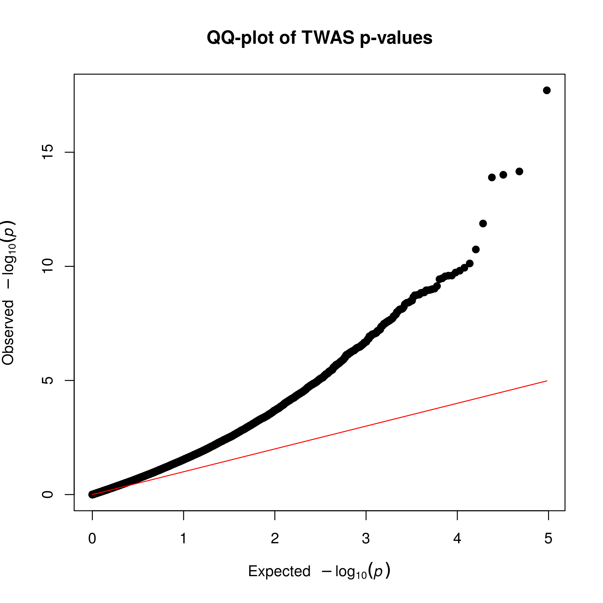

As shown below in the QQ-plot, our p-values were smaller than expected, indicating the presence of multiple significant associations. Inflation is present, but this expected due to the polygenicity of Major Depression and the the correlation between predicted expression of genes. 

***

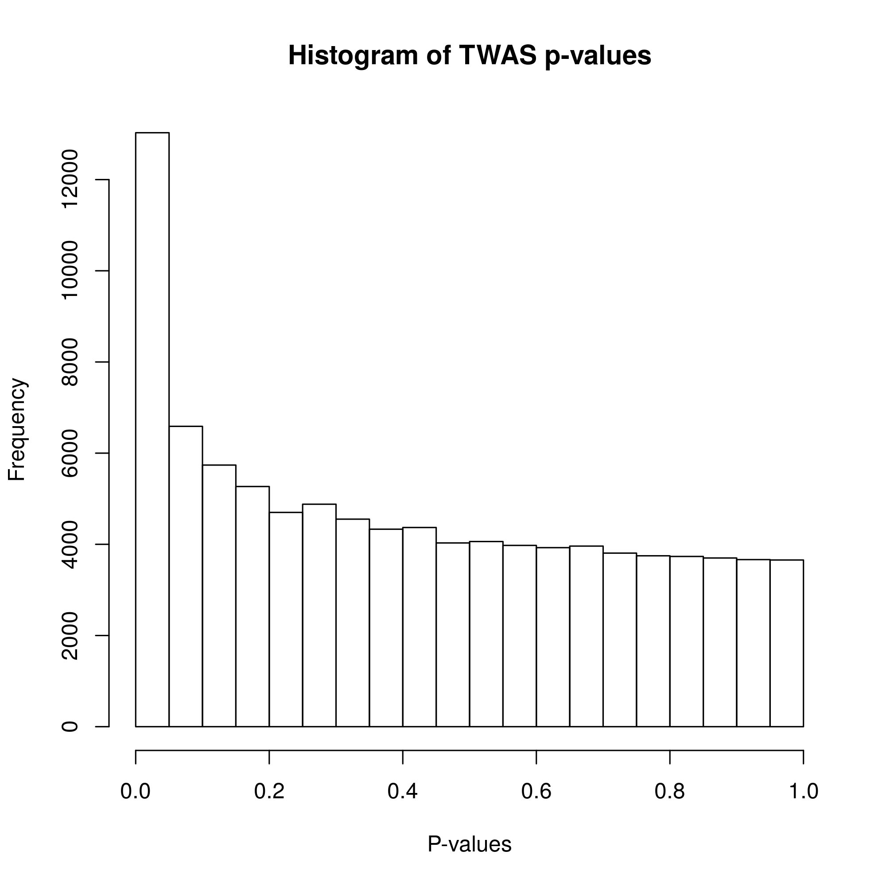

As shown in the histogram of p-values, our p-values followed a normal distribution as evidenced in the bottom of the graph where a similar amount of p-values is present. Additionally, a peak in correspondence to very small p-values is present at the top of the graph, indicating the presence of signal for our alternative hypothesis. 

\center

</details>

<details><summary>Create heatmaps for shared and unique associations</summary>
```{r, eval=F, echo=T}
# Given the high number of hits we identified (N=177), from 91 unique genes, a single heatmap representing all of such genes cannot be created. Therefore, we depicted our results in two heatmaps: 1) heatmap of genes differentially expressed across multiple SNP-weight sets & 2) heatmap of genes differentially across a single SNP-weight

rm(list=ls())
library(data.table)
library(ggplot2)
library(cowplot)

#load data
twas <- fread("/users/k1806347/brc_scratch/Analyses/Lorenza/Clean/TWAS/MDD_TWAS_AllTissues_CLEAN.txt")
head(twas)

# Extract only certain columns
twas_sub <- twas[,c('ID','PANEL_clean_short','CHR','P0','P1','TWAS.Z', 'TWAS.P')]
str(twas_sub)
str(twas)

#filter for sign. gene IDs only 
sign_feat<-twas_sub[twas_sub$TWAS.P < 1.368572e-06,'ID']  #to get a vector with the gene IDs of the significant features
str(sign_feat)  #find 176 features as supposed to - genes are repeated though --> you need single gene IDs

sign_genes<-unique(sign_feat)  #to identify unique gene IDs
str(sign_genes)  #94 gene IDs as expected

twas_sub[order(twas_sub$ID), ]
sign_genes[order(sign_genes$ID), ]

twas_sub <- twas_sub[(twas_sub$ID %in% sign_genes$ID), ]
str(twas_sub)  #611 observations where each observation corresponds to an ID in the sign-feat vector

#prepare a vector of gene IDs which are duplicated
duplicates_df<-sign_feat[duplicated(sign_feat)] 
duplicates <- duplicates_df$ID

# The following code is necessary to depict results from the CMC DLPFC splicing panel 
# Since in RNA-seq splicing multiple transcripts of the same gene are generally tested and we can depict just one in the heatmap, we need to pick the most significant one. This is done below. 

### 
# RETAIN THE MOST SIGN. FEATURE FROM THE CMC BRAIN SPLICING RESULTS
###

twas_sub <- twas_sub[order(twas_sub$TWAS.P), ] #we order by p-value to make sure that the most significant 
#CMC DLPFC feature for a given gene is kept and that its duplicates (which are less sign.) are excluded
head(twas_sub)
tail(twas_sub)

library(dplyr)
twas_sub  <- twas_sub %>% distinct(ID, PANEL_clean_short, .keep_all = T)  #to get rid of rows which contain duplicates based on the ID and PANEL cols 
#in our case, this is just for duplicates in the cmc brain splicing weights with the same gene id

twas_sub_temp <- twas_sub[order(twas_sub$ID), ] #to check that it worked 
#there should be just one of the same gene id from brain seq splicing weights
#this is the case, with the mmost sign. one being kept. 
#NB 43 gene IDs from the same snp weight were gotten rid of in this df for a total of 568 features instead of 611 

####
# Heatmap of genes differentially expressed across multiple SNP-weight sets
####
###
# make a list of features significant in multiple tissues
###

#order files  
twas_sub2<-twas_sub[order(twas_sub$ID),] 
duplicates<-sort(duplicates, decreasing = FALSE)   

#filter the twas_sub datatable by the duplicates vector to obtain a dt with features expressed across diff. tissues only (i.e. no unique features)
twas_sub2<-twas_sub[(twas_sub$ID %in% duplicates), ] #283 obs.
str(twas_sub2)

# Sort the data.frame by CHR and P0 
twas_sub2<-twas_sub2[order(twas_sub2$CHR,twas_sub2$P0),]

# Make ID a factor for plotting where unique gene IDs are the levels/categories of such factor 
twas_sub2$ID<-factor(twas_sub2$ID, levels=unique(twas_sub2$ID))
str(twas_sub2) #there are 36 levels (i.e. 36 unique genes differentially expressed across multiple weights)

#create a vector with all TWAS.Z values
TWAS.Z <- twas_sub2$TWAS.Z

twas_sub2_unique<-twas_sub2[!duplicated(twas_sub2$ID),]
vline_1<-min(which(twas_sub2_unique$CHR == 6 & twas_sub2_unique$P0 > 26e6 & twas_sub2_unique$P1 < 34e6))
vline_2<-max(which(twas_sub2_unique$CHR == 6 & twas_sub2_unique$P0 > 26e6 & twas_sub2_unique$P1 < 34e6))

#create the heatmap
png("/users/k1806347/brc_scratch/Analyses/Lorenza/Clean/TWAS/MDD_TWAS.TWAS_Z_heatmap.shared.png",width = 3500, height = 1750, units = "px", res=300)

ggplot(data = twas_sub2, aes(x = ID, y = PANEL_clean_short)) +
  #genes as x axis, panel as y axis  
  theme_bw()	+    #saying that there will be grid lines
  geom_tile(aes(fill = TWAS.Z), colour = 'black') +
  scale_fill_gradientn(colours=c("dodgerblue2","white","red"), na.value = 'white',name = "Z-score") +
  theme(axis.text.x = element_text(angle = 45, hjust = 1),plot.title = element_text(hjust = 0.5)) +
  geom_text(aes(label=round(TWAS.Z,1)), color="black", size=3) +
  labs(title="Genes differentially expressed across multiple SNP-weight sets",  x ="Gene ID", y = "SNP-weight sets") +
  geom_vline(xintercept = vline_1-0.5, size=1) +
  geom_vline(xintercept = vline_2+0.5, size=1)

#title and labels shown for the x and y axes
dev.off()

# Note significant features presented a z-score > 4.83 or < -4.83.  

#### 
# Heatmap of genes differentially expressed in one SNP-weight 
####

#create a dt with the duplicates removed (!), so that we obtain only unique features
twas_unique<-twas_sub[(!twas_sub$ID %in% duplicates), ]  
str(twas_unique)   #we get 285 features from differentially expressed genes uniquely differentially expressed in one tissue

# Sort the data.frame by CHR and P0
twas_unique<-twas_unique[order(twas_unique$CHR,twas_unique$P0),]  #it's important to order by both
#if you order by pos only, the chr11 stuff will come first!

# Make ID a factor for plotting where unique gene IDs are the levels/categories of such factor 
twas_unique$ID<-factor(twas_unique$ID, levels=unique(twas_unique$ID))
str(twas_unique)

#create a vector with all TWAS.Z values
TWAS.Z <- twas_unique$TWAS.Z

twas_unique_unique<-twas_unique[!duplicated(twas_unique$ID),]
vline_1<-min(which(twas_unique_unique$CHR == 6 & twas_unique_unique$P0 > 26e6 & twas_unique_unique$P1 < 34e6))
vline_2<-max(which(twas_unique_unique$CHR == 6 & twas_unique_unique$P0 > 26e6 & twas_unique_unique$P1 < 34e6))

#create the heatmap
png("/users/k1806347/brc_scratch/Analyses/Lorenza/Clean/TWAS/MDD_TWAS.TWAS_Z_heatmap.unique.png",width = 4650, height = 1750, units = "px", res=300)

ggplot(data = twas_unique, aes(x = ID, y = PANEL_clean_short)) +
  theme_bw()	+    
  geom_tile(aes(fill = TWAS.Z), colour = 'black') +
  scale_fill_gradientn(colours=c("dodgerblue2","white","red"), na.value = 'white',name = "Z-score") +
  theme(axis.text.x = element_text(angle = 45, hjust = 1),plot.title = element_text(hjust = 0.5)) +
  geom_text(aes(label=round(TWAS.Z,1)), color="black", size=3) +
  labs(title="Genes differentially expressed in single SNP-weight sets",  x ="Gene ID", y = "SNP-weight sets") +
  geom_vline(xintercept = vline_1-0.5, size=1) +
  geom_vline(xintercept = vline_2+0.5, size=1)

dev.off()

# Note significant features presented a z-score > 4.83 or < -4.83.  
```
</details>

<details><summary>Create heatmaps for tissue groups</summary>
```{R, eval=F, echo=T}
# Heatmaps for groups of tissues were made to show the overlap across SNP-weight panels. 

rm(list=ls())
library(data.table)
library(ggplot2)
library(cowplot)

###
# Load and prepare data
###

#load
twas <- fread("/users/k1806347/brc_scratch/Analyses/Lorenza/Clean/TWAS/MDD_TWAS_AllTissues_CLEAN.txt")

#subset columns needed 
twas_sub <- twas[,c('ID','PANEL', 'PANEL_clean_short', 'CHR','P0', 'P1', 'TWAS.Z', 'TWAS.P')]
str(twas_sub)

#turn CHR and P0 into numerical variables 
twas_sub$CHR <- as.numeric(as.character(twas_sub$CHR))
twas_sub$P0 <- as.numeric(as.character(twas_sub$P0))
str(twas_sub)

###
# Keep only the most sign. feature from the CMC brain splicing results
###
twas_sub2 <- twas_sub[order(twas_sub$TWAS.P), ]
head(twas_sub2)
tail(twas_sub2)

library(dplyr)
twas_sub  <- twas_sub2 %>% distinct(ID, PANEL, .keep_all = T)


###
# Create df for groups of tissues
###

#order by CHR and P0 first
twas2 <- twas_sub[order(twas_sub$CHR,twas_sub$P0),]
twas_sub <- twas2


#create df
twas_brain.df <- twas_sub[twas_sub$PANEL %in% c("Brain_Amygdala", "Brain_Anterior_cingulate_cortex_BA24", "Brain_Caudate_basal_ganglia", "Brain_Cerebellar_Hemisphere", "Brain_Cerebellum", "Brain_Cortex", "Brain_Frontal_Cortex_BA9", "Brain_Hippocampus", "Brain_Hypothalamus", "Brain_Nucleus_accumbens_basal_ganglia", "Brain_Putamen_basal_ganglia", "Brain_Substantia_nigra", "CMC.BRAIN.RNASEQ", "CMC.BRAIN.RNASEQ_SPLICING","PsychENCODE"), ]
twas_blood.df <- twas_sub[twas_sub$PANEL %in% c("Whole_Blood", "NTR.BLOOD.RNAARR", "YFS.BLOOD.RNAARR"), ]
twas_HPA.df <- twas_sub[twas_sub$PANEL %in% c("Brain_Hypothalamus", "Pituitary", "Adrenal_Gland"), ]
twas_HPT.df <- twas_sub[twas_sub$PANEL %in% c("Brain_Hypothalamus", "Pituitary","Thyroid"), ]

###
#filter for gene IDs significant in a given group of tissues only 
###

#get sign. gene ID per group of tissues
sign_feat_brain<-twas_brain.df[twas_brain.df$TWAS.P < 1.368572e-06,]$ID  #to get a vector with the gene IDs of the significant features
#101 features are sign. within brain snp weight sets
str(sign_feat_brain)
sign_feat_brain <- unique(sign_feat_brain)  #111 unique genes differentially expressed in brain snp weights


sign_feat_blood<-twas_blood.df[twas_blood.df$TWAS.P < 1.368572e-06,]$ID 
str(sign_feat_blood) #26
sign_feat_blood <- unique(sign_feat_blood)#23


sign_feat_HPA<-twas_HPA.df[twas_HPA.df$TWAS.P < 1.368572e-06,]$ID  #to get a vector with the gene IDs of the significant features
str(sign_feat_HPA) #28
sign_feat_HPA <- unique(sign_feat_HPA)  #22


sign_feat_HPT<-twas_HPT.df[twas_HPT.df$TWAS.P < 1.368572e-06,]$ID  #to get a vector with the gene IDs of the significant features
str(sign_feat_HPT) #41
sign_feat_HPT <- unique(sign_feat_HPT)  #34

#filter
twas_brain.df <- twas_brain.df[(twas_brain.df$ID %in% sign_feat_brain), ]
#320 obs.
twas_blood.df <- twas_blood.df[(twas_blood.df$ID %in% sign_feat_blood), ] #32
twas_HPA.df <- twas_HPA.df[(twas_HPA.df$ID %in% sign_feat_HPA), ] #32
twas_HPT.df <- twas_HPT.df[(twas_HPT.df$ID %in% sign_feat_HPT), ] #51 features with the gene ID within the vector sign feat...

#create vectors with the z scores of the features within specific tissues
TWAS.Z.brain <- twas_brain.df$TWAS.Z
TWAS.Z.blood <- twas_blood.df$TWAS.Z
TWAS.Z.HPA <- twas_HPA.df$TWAS.Z
TWAS.Z.HPT <- twas_HPT.df$TWAS.Z

# Make ID a factor for plotting
twas_brain.df$ID<-factor(twas_brain.df$ID, levels = unique(twas_brain.df$ID))
twas_blood.df$ID<-factor(twas_blood.df$ID, levels = unique(twas_blood.df$ID))
twas_HPA.df$ID<-factor(twas_HPA.df$ID, levels = unique(twas_HPA.df$ID))
twas_HPT.df$ID<-factor(twas_HPT.df$ID, levels = unique(twas_HPT.df$ID))

#####
# Heatmap for brain SNP-weight sets
#####

twas_brain.df_unique<-twas_brain.df[!duplicated(twas_brain.df$ID),]
vline_1<-min(which(twas_brain.df_unique$CHR == 6 & twas_brain.df_unique$P0 > 26e6 & twas_brain.df_unique$P1 < 34e6))
vline_2<-max(which(twas_brain.df_unique$CHR == 6 & twas_brain.df_unique$P0 > 26e6 & twas_brain.df_unique$P1 < 34e6))

#Plot brain SNP weights
png("/users/k1806347/brc_scratch/Analyses/Lorenza/Clean/TWAS/MDD_TWAS.TWAS_Z_heatmap_brain.png",width = 5100, height = 1400, units = "px", res=300)

ggplot(data = twas_brain.df, aes(x = ID, y = PANEL_clean_short)) +
  theme_bw()	+   
  geom_tile(aes(fill = TWAS.Z.brain), colour = 'black') +
  scale_fill_gradientn(colours=c("dodgerblue2","white","red"), na.value = 'white',name = "Z-score") +
  theme(axis.text.x = element_text(angle = 45, hjust = 1),plot.title = element_text(hjust = 0.5)) +
  geom_text(aes(label=round(TWAS.Z.brain,1)), color="black", size=3) +
  labs(title="Genes differentially expressed in brain SNP-weight sets",  x ="Gene ID", y = "SNP-weight sets") +
  geom_vline(xintercept = vline_1-0.5, size=1) +
  geom_vline(xintercept = vline_2+0.5, size=1)

dev.off()

# Note significant features presented a z-score > 4.83 or < -4.83.  

#####
# Plot for blood SNP-weight sets
#####

twas_blood.df_unique<-twas_blood.df[!duplicated(twas_blood.df$ID),]
vline_1<-min(which(twas_blood.df_unique$CHR == 6 & twas_blood.df_unique$P0 > 26e6 & twas_blood.df_unique$P1 < 34e6))
vline_2<-max(which(twas_blood.df_unique$CHR == 6 & twas_blood.df_unique$P0 > 26e6 & twas_blood.df_unique$P1 < 34e6))

#Plot blood findings
png("/users/k1806347/brc_scratch/Analyses/Lorenza/Clean/TWAS/MDD_TWAS.TWAS_Z_heatmap_blood.png",width = 2400, height = 800, units = "px", res=300)

ggplot(data = twas_blood.df, aes(x = ID, y = PANEL_clean_short)) +
  theme_bw()	+   
  geom_tile(aes(fill = TWAS.Z.blood), colour = 'black') +
  scale_fill_gradientn(colours=c("dodgerblue2","white","red"), na.value = 'white',name = "Z-score") +
  theme(axis.text.x = element_text(angle = 45, hjust = 1),plot.title = element_text(hjust = 0.5)) +
  geom_text(aes(label=round(TWAS.Z.blood,1)), color="black", size=3) +
  labs(title="Genes differentially expressed in blood SNP-weight sets",  x ="Gene ID", y = "SNP-weight sets") +
  geom_vline(xintercept = vline_1-0.5, size=1) +
  geom_vline(xintercept = vline_2+0.5, size=1)
dev.off()

# Note significant features presented a z-score > 4.83 or < -4.83.  

#####
# Plot for HPA axis SNP-weight sets
#####

twas_HPA.df_unique<-twas_HPA.df[!duplicated(twas_HPA.df$ID),]
vline_1<-min(which(twas_HPA.df_unique$CHR == 6 & twas_HPA.df_unique$P0 > 26e6 & twas_HPA.df_unique$P1 < 34e6))
vline_2<-max(which(twas_HPA.df_unique$CHR == 6 & twas_HPA.df_unique$P0 > 26e6 & twas_HPA.df_unique$P1 < 34e6))

#Plot HPA axis findings
png("/users/k1806347/brc_scratch/Analyses/Lorenza/Clean/TWAS/MDD_TWAS.TWAS_Z_heatmap_HPA.png",width = 2400, height = 800, units = "px", res=300)

ggplot(data = twas_HPA.df, aes(x = ID, y = PANEL_clean_short)) +
  theme_bw()	+   
  geom_tile(aes(fill = TWAS.Z.HPA), colour = 'black') +
  scale_fill_gradientn(colours=c("dodgerblue2","white","red"), na.value = 'white',name = "Z-score") +
  theme(axis.text.x = element_text(angle = 45, hjust = 1),plot.title = element_text(hjust = 0.5)) +
  geom_text(aes(label=round(TWAS.Z.HPA,1)), color="black", size=3) +
  labs(title="Genes differentially expressed in HPA axis SNP-weight sets",  x ="Gene ID", y = "SNP-weight sets") +
  geom_vline(xintercept = vline_1-0.5, size=1) +
  geom_vline(xintercept = vline_2+0.5, size=1)
dev.off()

# Note significant features presented a z-score > 4.83 or < -4.83.  

#####
# Plot for HPT axis SNP-weight sets
#####

twas_HPT.df_unique<-twas_HPT.df[!duplicated(twas_HPT.df$ID),]
vline_1<-min(which(twas_HPT.df_unique$CHR == 6 & twas_HPT.df_unique$P0 > 26e6 & twas_HPT.df_unique$P1 < 34e6))
vline_2<-max(which(twas_HPT.df_unique$CHR == 6 & twas_HPT.df_unique$P0 > 26e6 & twas_HPT.df_unique$P1 < 34e6))

#Plot HPT axis findings
png("/users/k1806347/brc_scratch/Analyses/Lorenza/Clean/TWAS/MDD_TWAS.TWAS_Z_heatmap_HPT.png",width = 3000, height = 800, units = "px", res=300)
ggplot(data = twas_HPT.df, aes(x = ID, y = PANEL_clean_short)) +
  theme_bw()	+   
  geom_tile(aes(fill = TWAS.Z.HPT), colour = 'black') +
  scale_fill_gradientn(colours=c("dodgerblue2","white","red"), na.value = 'white',name = "Z-score") +
  theme(axis.text.x = element_text(angle = 45, hjust = 1),plot.title = element_text(hjust = 0.5)) +
  geom_text(aes(label=round(TWAS.Z.HPT,1)), color="black", size=3) +
  labs(title="Genes differentially expressed in HPT axis SNP-weight sets",  x ="Gene ID", y = "SNP-weight sets") +
  geom_vline(xintercept = vline_1-0.5, size=1) +
  geom_vline(xintercept = vline_2+0.5, size=1)
dev.off()

# Note significant features presented a z-score > 4.83 or < -4.83.  
```
</details>

```{bash, eval=T, echo=F}
cp /users/k1806347/brc_scratch/Analyses/Lorenza/Clean/TWAS/MDD_TWAS.TWAS_Z_heatmap.shared.png /users/k1806347/brc_scratch/Software/MyGit/MDD-TWAS/Images/

cp /users/k1806347/brc_scratch/Analyses/Lorenza/Clean/TWAS/MDD_TWAS.TWAS_Z_heatmap.unique.png /users/k1806347/brc_scratch/Software/MyGit/MDD-TWAS/Images/

cp /users/k1806347/brc_scratch/Analyses/Lorenza/Clean/TWAS/MDD_TWAS.TWAS_Z_heatmap_brain.png /users/k1806347/brc_scratch/Software/MyGit/MDD-TWAS/Images/

cp /users/k1806347/brc_scratch/Analyses/Lorenza/Clean/TWAS/MDD_TWAS.TWAS_Z_heatmap_blood.png /users/k1806347/brc_scratch/Software/MyGit/MDD-TWAS/Images/

cp /users/k1806347/brc_scratch/Analyses/Lorenza/Clean/TWAS/MDD_TWAS.TWAS_Z_heatmap_HPA.png /users/k1806347/brc_scratch/Software/MyGit/MDD-TWAS/Images/

cp /users/k1806347/brc_scratch/Analyses/Lorenza/Clean/TWAS/MDD_TWAS.TWAS_Z_heatmap_HPT.png /users/k1806347/brc_scratch/Software/MyGit/MDD-TWAS/Images/
```

<details><summary>Show plots</summary>

<center>

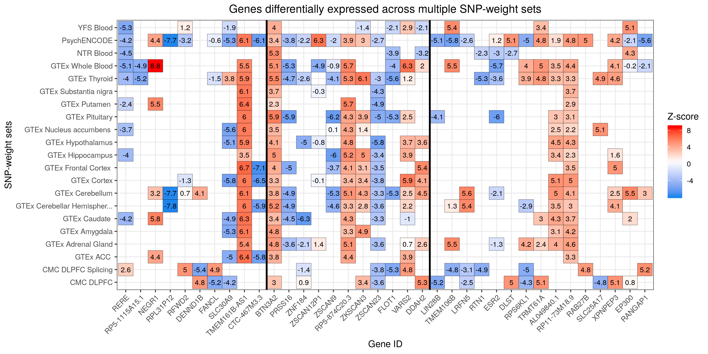

***

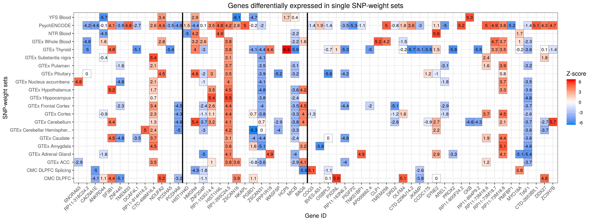

***

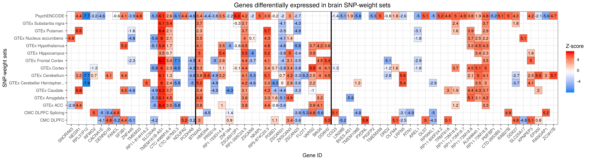
***

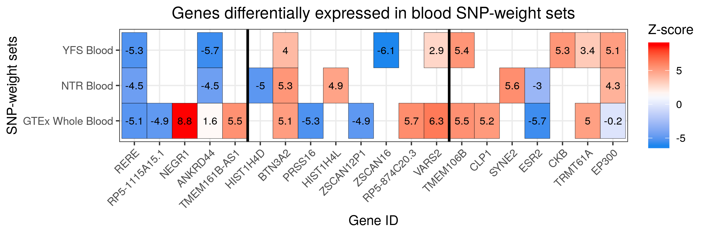

***

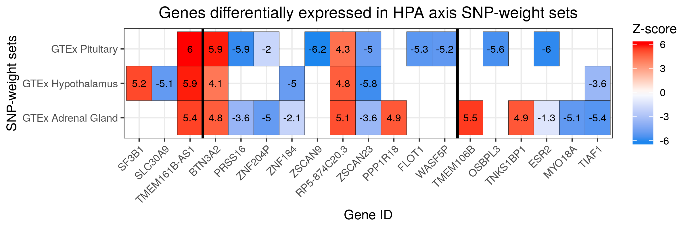

***

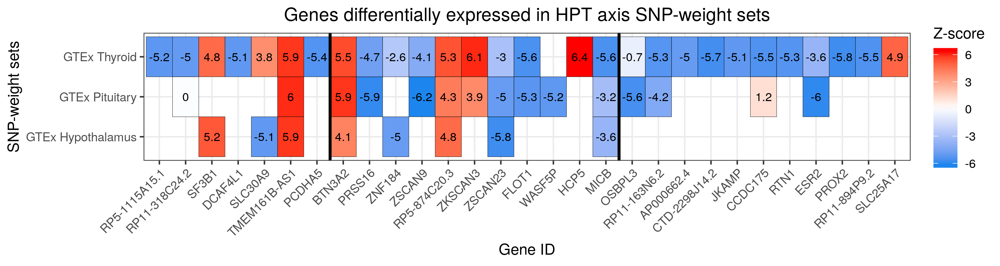

***

\center

</details>

***

## Process colocalisation results

Colocalisation identified whether TWAS and GWAS associations result from the same or distinct causal SNP.

<details><summary>Organise results</summary>
```{r, eval=F, echo=T}
###
# Create a table with colocalisation results for all significant features
###
rm(list=ls())
library(data.table)
twas_sign <- fread("/users/k1806347/brc_scratch/Analyses/Lorenza/Clean/TWAS/MDD_TWAS_AllTissues_TWSig_CLEAN.txt")

library(tibble)
twas_sign <- as_data_frame(twas_sign)
colnames(twas_sign)

twas_sign$Location<-paste0('chr',twas_sign$CHR,':',twas_sign$P0,'-',twas_sign$P1)   

#transform variables into numeric and then order by them
str(twas_sign)
as.numeric(as.character(twas_sign$CHR))
as.numeric(as.character(twas_sign$P0))
twas_sign_ordered <- twas_sign[order(twas_sign$CHR, twas_sign$P0), ]

col_order <- c("Location", "ID", "PANEL_clean_short", "TWAS.Z", "TWAS.P", "COLOC.PP0", "COLOC.PP1", "COLOC.PP2", "COLOC.PP3", "COLOC.PP4")
twas_sign_ordered <- twas_sign_ordered[, col_order]
twas_sign_ordered

###
#Create a couple of additional columns specifying whether the feature is colocalised or not
###

#to specify coloc pp4 > 0.8 (see gusev et al (2019) Nat Genet on epithelial ovarian cancer)
twas_sign_ordered$High_PP4_0.8 <- NULL
twas_sign_ordered$High_PP4_0.8 <- ifelse(twas_sign_ordered$COLOC.PP4 > 0.8, "Yes", "No")
sum(twas_sign_ordered$High_PP4_0.8 == "Yes")  #97 features present a PP4 greater than 0.8

#to specify coloc pp3 < 0.2 
twas_sign_ordered$Low_PP3_0.2 <- NULL
twas_sign_ordered$Low_PP3_0.2 <- ifelse(twas_sign_ordered$COLOC.PP3 < 0.2, "Yes", "No")
sum(twas_sign_ordered$Low_PP3_0.2 == "Yes") #140 features present a PP3 smaller than 0.2

#specify whether both conditions are satisfied (NB PP4 > 0.8 is much more of a stringent threshold)
twas_sign_ordered$Colocalised <- NULL
twas_sign_ordered$Colocalised <- ifelse(twas_sign_ordered$High_PP4_0.8 == "Yes" & twas_sign_ordered$Low_PP3_0.2 == "Yes", "Yes", "No")
sum(twas_sign_ordered$Colocalised == "Yes") #97 features are colocalised

#get the number of unique genes which were colocalised
colocalised_df <- twas_sign_ordered[twas_sign_ordered$Colocalised == "Yes", ] #as expected, dim = 97, 13
colocalised_vector <- colocalised_df$ID 
unique_genes_colocalised <- unique(colocalised_vector) #57 unique genes which were colocalised


###
# Clean and Save 
###
col_order2 <- c("Location", "ID", "PANEL_clean_short", "TWAS.Z", "TWAS.P", "COLOC.PP0", "COLOC.PP1", "COLOC.PP2", "COLOC.PP3", "COLOC.PP4", "Low_PP3_0.2", "High_PP4_0.8", "Colocalised")
twas_sign_ordered <- twas_sign_ordered[, col_order2]
twas_sign_ordered

write.csv(twas_sign_ordered, "/users/k1806347/brc_scratch/Analyses/Lorenza/Clean/TWAS/MDD_TWAS_colocalisation.csv", row.names = F)

q()
n

```
</details>

<details><summary>Show colocalisation table</summary>
```{R, echo=F, eval=T}
res<-read.csv('/users/k1806347/brc_scratch/Analyses/Lorenza/Clean/TWAS/MDD_TWAS_colocalisation.csv')

library(knitr)
kable(res, rownames = FALSE, caption='MDD TWAS Colocalisation Results', digits = 32)
```

</details>

</br>

140 of the 176 significant features presented a low posterior probability of TWAS and GWAS associations resulting from distinct causal SNPs. This is a good index of colocalisation, but PP4, should also be considered due to the possibility of other models besides PP3 and PP4 to be the most probable. When considering features with high PP4 (> 0.8), 97 of the 140 features with low PP3 also presented a high probability of GWAS and TWAS associations resulting from the same causal SNP. Therefore, based on both criteria applied, we considered 97 features as colocalised.

***
## Process conditional analysis results
<details><summary>Organise coloc results</summary>
```{r, eval=F, echo=T}
# Read in the report files
library(data.table)
setwd("/users/k1806347/brc_scratch/Analyses/Lorenza/Clean/Conditional")

# Read in the clean TWAS results
twas_sign <- fread("/users/k1806347/brc_scratch/Analyses/Lorenza/Clean/TWAS/MDD_TWAS_AllTissues_TWSig_CLEAN.txt")
twas_sign$PANEL_clean<-gsub(' $','',twas_sign$PANEL_clean)

# Read in all jointly significant associations
temp = list.files(pattern=glob2rx("*chr*.report"))
report<-do.call(rbind, lapply(temp, function(x) read.table(x, header=T,stringsAsFactors=F)))
report$JOINT.ID<-NA
report$MARGIN.ID<-NA
report$JOINT.N<-NA
report$MARGIN.N<-NA
report$loc<-gsub('.*loc_','',report$FILE)
joint_res<-NULL
margin_res<-NULL

# Insert names of jointly significant genes
for(i in unique(report$CHR)){
  joint_i<-read.table(paste0('test.cond.chr',i,'.joint_included.dat'), header=T,stringsAsFactors=F)
  margin_i<-read.table(paste0('test.cond.chr',i,'.joint_dropped.dat'), header=T,stringsAsFactors=F)
  
  joint_i$path<-gsub('/[^/]+$','',joint_i$FILE)
    joint_i$path<-gsub('/[^/]+$','',joint_i$path)
    joint_i$WGT<-NA
    for(j in 1:dim(joint_i)[1]){
      joint_i$WGT[j]<-gsub(paste0(joint_i$path[j],'/'),'',joint_i$FILE[j])
  }

  if(dim(margin_i)[1] > 0){
    margin_i$path<-gsub('/[^/]+$','',margin_i$FILE)
    margin_i$path<-gsub('/[^/]+$','',margin_i$path)
    margin_i$WGT<-NA
    for(j in 1:dim(margin_i)[1]){
      margin_i$WGT[j]<-gsub(paste0(margin_i$path[j],'/'),'',margin_i$FILE[j])
    }
  }

  temp = list.files(pattern=glob2rx(paste0("*chr",i,".loc*.genes")))

  for(k in 1:length(temp)){
    loc_k<-read.table(paste0('test.cond.chr',i,'.loc_',k,'.genes'), header=T, stringsAsFactors=F)
    
    loc_k$path<-gsub('/[^/]+$','',loc_k$FILE)
    loc_k$path<-gsub('/[^/]+$','',loc_k$path)
    loc_k$WGT<-NA
    for(j in 1:dim(loc_k)[1]){
      loc_k$WGT[j]<-gsub(paste0(loc_k$path[j],'/'),'',loc_k$FILE[j])
    }

    loc_k$P0<-NULL
    loc_k$P1<-NULL
    
    loc_k<-merge(loc_k, twas_sign[,c('P0','P1','WGT','PANEL_clean')], by='WGT')
    
    loc_k_joint<-loc_k[(loc_k$WGT %in% joint_i$WGT),]
    joint_res<-rbind(joint_res,loc_k_joint)
        
    if(dim(margin_i)[1] > 0){
      loc_k_margin<-loc_k[(loc_k$WGT %in% margin_i$WGT),]
      margin_res<-rbind(margin_res,loc_k_margin)
    } else {
      loc_k_margin<-data.frame(ID=NULL)
    }
    
    g_list<-NULL
    for(g in unique(loc_k_joint$ID)){
      g_list<-c(g_list,paste0(g, " (",paste(loc_k_joint$PANEL_clean[loc_k_joint$ID == g], collapse=', '),")"))
    }
    report[report$CHR == i & report$loc == k,]$JOINT.ID<-paste(g_list,collapse=', ')

    if(dim(loc_k_margin)[1] > 0){
      g_list<-NULL
      for(g in unique(loc_k_margin$ID)){
        g_list<-c(g_list,paste0(g, " (",paste(unique(loc_k_margin$PANEL_clean[loc_k_margin$ID == g]), collapse=', '),")"))
      }
      report[report$CHR == i & report$loc == k,]$MARGIN.ID<-paste(g_list,collapse=', ')
    } else {
      report[report$CHR == i & report$loc == k,]$MARGIN.ID<-'-'
    }
    
    report[report$CHR == i & report$loc == k,]$JOINT.N<-dim(loc_k_joint)[1]
    report[report$CHR == i & report$loc == k,]$MARGIN.N<-dim(loc_k_margin)[1]
  }
}

report$LOCUS<-paste0(report$CHR,':',report$P0,':',report$P1)
report$BP<-paste0(report$P0,'-',report$P1)
report$VAR.EXP<-paste0(report$VAR.EXP*100,'%')

report<-report[,c('CHR','P0','P1','BP','LOCUS',"JOINT.N",'MARGIN.N','BEST.TWAS.P','BEST.SNP.P','VAR.EXP','JOINT.ID','MARGIN.ID')]

report<-report[order(report$CHR, report$P0),]

# Save full conditional results table
write.csv(report[,c("CHR","BP","JOINT.ID","MARGIN.ID","BEST.TWAS.P","BEST.SNP.P","VAR.EXP")],'/users/k1806347/brc_scratch/Analyses/Lorenza/Clean/Conditional/MDD_TWAS_Conditional_table_full.csv', row.names=F, quote=T)

# Save brief conditional results table
write.csv(report[,c('CHR','BP','JOINT.ID','MARGIN.N','BEST.TWAS.P','BEST.SNP.P','VAR.EXP')],'/users/k1806347/brc_scratch/Analyses/Lorenza/Clean/Conditional/MDD_TWAS_Conditional_table_brief.csv', row.names=F, quote=T)

# Combine gene results for marginal and joint genes
joint_res$Type<-'Joint'
margin_res$Type<-'Marginal'

gene_res<-rbind(joint_res, margin_res)

# Check number of indepenent associations
dim(joint_res) # 50

# Check number of independent associations without genome-wide significant snp
dim(joint_res[2*pnorm(-abs(joint_res$BEST.GWAS.Z)) > 5e-8,]) # 25

# Check number of independent associations with genome-wide significant snp but an r2 with predicted expression <0.1
dim(joint_res[2*pnorm(-abs(joint_res$BEST.GWAS.Z)) < 5e-8 & joint_res$TOP.SNP.COR^2 < 0.1,]) # 2

# Check number of independent novel associations
dim(joint_res[(2*pnorm(-abs(joint_res$BEST.GWAS.Z)) < 5e-8 & joint_res$TOP.SNP.COR^2 < 0.1) | 2*pnorm(-abs(joint_res$BEST.GWAS.Z)) > 5e-8,]) # 27

# Check number of novel associations
dim(gene_res[(2*pnorm(-abs(gene_res$BEST.GWAS.Z)) < 5e-8 & gene_res$TOP.SNP.COR^2 < 0.1) | 2*pnorm(-abs(gene_res$BEST.GWAS.Z)) > 5e-8,]) # 68

gene_res$Novel<-'No'
gene_res$Novel[(2*pnorm(-abs(gene_res$BEST.GWAS.Z)) < 5e-8 & gene_res$TOP.SNP.COR^2 < 0.1) | 2*pnorm(-abs(gene_res$BEST.GWAS.Z)) > 5e-8]<-'Yes'

gene_res$BP<-paste0(gene_res$P0,'-',gene_res$P1)
gene_res$BEST.GWAS.P<-2*pnorm(-abs(gene_res$BEST.GWAS.Z))

gene_res<-gene_res[order(gene_res$CHR, gene_res$P0),]

gene_res$Colocalised<-F
gene_res$Colocalised[gene_res$COLOC.PP4 >0.8]<-T

# Check number of independent novel associations which colocalise for joint genes
joint_res$Colocalised<-F
joint_res$Colocalised[joint_res$COLOC.PP4 >0.8]<-T

dim(joint_res[(2*pnorm(-abs(joint_res$BEST.GWAS.Z)) < 5e-8 & joint_res$TOP.SNP.COR^2 < 0.1 & joint_res$Colocalised == T) | (2*pnorm(-abs(joint_res$BEST.GWAS.Z)) > 5e-8 & joint_res$Colocalised == T),]) # 12

# Check number of novel associations which colocalise
dim(gene_res[(2*pnorm(-abs(gene_res$BEST.GWAS.Z)) < 5e-8 & gene_res$TOP.SNP.COR^2 < 0.1 & gene_res$Colocalised == T) | (2*pnorm(-abs(gene_res$BEST.GWAS.Z)) > 5e-8 & gene_res$Colocalised == T),]) # 45

gene_res<-gene_res[,c('CHR','BP','P0','P1','ID','PANEL_clean','WGT','TWAS.Z','TWAS.P','BEST.GWAS.P','TOP.SNP.COR','Type','Novel','COLOC.PP3','COLOC.PP4','Colocalised')]

# Save table showing whether gene associations are novel
write.csv(gene_res,'/users/k1806347/brc_scratch/Analyses/Lorenza/Clean/Conditional/MDD_TWAS_Conditional_table_novelty.csv', row.names=F, quote=T)

```
</details>

<details><summary>Show full conditional analysis table</summary>
```{R, echo=F, eval=T}
res<-read.csv('/users/k1806347/brc_scratch/Analyses/Lorenza/Clean/Conditional/MDD_TWAS_Conditional_table_full.csv')

names(res)<-c("CHR","BP","Jointly sign. Features (SNP-weight set)","Marginally sign. Features (SNP-weight set)","Top TWAS p-value","Top GWAS p-value","Variance Explained")

library(knitr)
kable(res, rownames = FALSE, caption='MDD TWAS Full Conditional Results', digits = 32)
```

</details>

<details><summary>Show brief conditional analysis table</summary>
```{R, echo=F, eval=T}
res<-read.csv('/users/k1806347/brc_scratch/Analyses/Lorenza/Clean/Conditional/MDD_TWAS_Conditional_table_brief.csv')

names(res)<-c("CHR","BP","Jointly sign. Features (SNP-weight set)","N Marginal","Top TWAS p-value","Top GWAS p-value","Variance Explained")

library(knitr)
kable(res, rownames = FALSE, caption='MDD TWAS Brief Conditional Results', digits = 32)
```

</details>

***

## Novel findings

<details><summary>Show novelty table</summary>
```{R, echo=F, eval=T}
res<-read.csv('/users/k1806347/brc_scratch/Analyses/Lorenza/Clean/Conditional/MDD_TWAS_Conditional_table_novelty.csv')

res<-res[,c('CHR','BP','ID','PANEL_clean','WGT','TWAS.P','BEST.GWAS.P','TOP.SNP.COR','Type','Novel')]
names(res)<-c('CHR','BP','ID','PANEL','WGT','TWAS.P','BEST.GWAS.P','TOP.SNP.COR','TYPE','NOVEL')

res$BEST.GWAS.P<-format(res$BEST.GWAS.P, scientific = TRUE, digits = 3)

library(knitr)
kable(res, rownames = FALSE, caption='MDD TWAS Results Novelty compared to GWAS', digits = 32)
```

</details>

***
## FOCUS

<details><summary>Merge the relevent FOCUS databases</summary>
```{bash,echo=T, eval=F}
# Create a list of databases to be merged.
cat << 'EOF' > /scratch/groups/biomarkers-brc-mh/TWAS_resource/FOCUS/MDD_TWAS_db/MDD_TWAS_db_list.txt
/scratch/groups/biomarkers-brc-mh/TWAS_resource/FOCUS/SNP-weights/Adrenal_Gland.db
/scratch/groups/biomarkers-brc-mh/TWAS_resource/FOCUS/SNP-weights/Brain_Amygdala.db
/scratch/groups/biomarkers-brc-mh/TWAS_resource/FOCUS/SNP-weights/Brain_Anterior_cingulate_cortex_BA24.db
/scratch/groups/biomarkers-brc-mh/TWAS_resource/FOCUS/SNP-weights/Brain_Caudate_basal_ganglia.db
/scratch/groups/biomarkers-brc-mh/TWAS_resource/FOCUS/SNP-weights/Brain_Cerebellar_Hemisphere.db
/scratch/groups/biomarkers-brc-mh/TWAS_resource/FOCUS/SNP-weights/Brain_Cerebellum.db
/scratch/groups/biomarkers-brc-mh/TWAS_resource/FOCUS/SNP-weights/Brain_Cortex.db
/scratch/groups/biomarkers-brc-mh/TWAS_resource/FOCUS/SNP-weights/Brain_Frontal_Cortex_BA9.db
/scratch/groups/biomarkers-brc-mh/TWAS_resource/FOCUS/SNP-weights/Brain_Hippocampus.db
/scratch/groups/biomarkers-brc-mh/TWAS_resource/FOCUS/SNP-weights/Brain_Hypothalamus.db
/scratch/groups/biomarkers-brc-mh/TWAS_resource/FOCUS/SNP-weights/Brain_Nucleus_accumbens_basal_ganglia.db
/scratch/groups/biomarkers-brc-mh/TWAS_resource/FOCUS/SNP-weights/Brain_Putamen_basal_ganglia.db
/scratch/groups/biomarkers-brc-mh/TWAS_resource/FOCUS/SNP-weights/Brain_Spinal_cord_cervical_c-1.db
/scratch/groups/biomarkers-brc-mh/TWAS_resource/FOCUS/SNP-weights/Brain_Substantia_nigra.db
/scratch/groups/biomarkers-brc-mh/TWAS_resource/FOCUS/SNP-weights/CMC.BRAIN.RNASEQ.db
/scratch/groups/biomarkers-brc-mh/TWAS_resource/FOCUS/SNP-weights/CMC.BRAIN.RNASEQ_SPLICING.db
/scratch/groups/biomarkers-brc-mh/TWAS_resource/FOCUS/SNP-weights/NTR.BLOOD.RNAARR.db
/scratch/groups/biomarkers-brc-mh/TWAS_resource/FOCUS/SNP-weights/PEC_TWAS_weights.db
/scratch/groups/biomarkers-brc-mh/TWAS_resource/FOCUS/SNP-weights/Pituitary.db
/scratch/groups/biomarkers-brc-mh/TWAS_resource/FOCUS/SNP-weights/Thyroid.db
/scratch/groups/biomarkers-brc-mh/TWAS_resource/FOCUS/SNP-weights/Whole_Blood.db
/scratch/groups/biomarkers-brc-mh/TWAS_resource/FOCUS/SNP-weights/YFS.BLOOD.RNAARR.db
EOF

####
# Merge the databases
####
# I have written a script to do this in R
/users/k1806347/brc_scratch/Software/Rscript.sh /scratch/users/k1806347/Software/MyGit/FOCUS_db_merger/FOCUS_db_merger.r \
--dbs /scratch/groups/biomarkers-brc-mh/TWAS_resource/FOCUS/MDD_TWAS_db/MDD_TWAS_db_list.txt \
--out /scratch/groups/biomarkers-brc-mh/TWAS_resource/FOCUS/MDD_TWAS_db/MDD_TWAS

# This approach is giving strange results.
# Delete the output
```
</details>

<details><summary>Create FOCUS database for MDD TWAS</summary>
```{bash,echo=T, eval=F}
# Merging the databases causes some strange warnings
# Use the standard approach for the time being

########
# Import the FUSION SNP-weights to FOCUS format
########

# Import with all tissues in the MDD TWAS combined
# A shell script to do this has been written
mkdir -p /mnt/lustre/groups/biomarkers-brc-mh/TWAS_resource/FOCUS/MDD_TWAS_db

# Fusion weights
sbatch -p brc,shared --mem=10G /mnt/lustre/groups/biomarkers-brc-mh/TWAS_resource/FOCUS/MDD_TWAS_db/create_db_fusion.sh

# Onyl continue once the FUSION SNP-weights are in the database
# Psych ENCODE weights
sbatch -p brc,shared --mem=10G /mnt/lustre/groups/biomarkers-brc-mh/TWAS_resource/FOCUS/MDD_TWAS_db/create_db_psychENCODE.sh
```
</details>

<details><summary>Run FOCUS</summary>
```{bash, eval=F, echo=T}
########
# Finemap TWAS associations
########

# Use a threshold that will run FOCUS for all TWAS significant loci (max GWAS.P = 5e-6)
for chr in $(seq 1 22); do
sbatch -p brc,shared --mem=10G /users/k1806347/brc_scratch/Software/focus.sh finemap /users/k1806347/brc_scratch/Data/GWAS_sumstats/Lorenza/DEPR01.focus.sumstats.gz  /scratch/groups/biomarkers-brc-mh/Reference_data/1KG_Phase3/PLINK/EUR/EUR_phase3.MAF_001.chr${chr} /mnt/lustre/groups/biomarkers-brc-mh/TWAS_resource/FOCUS/MDD_TWAS_db/MDD_TWAS.db --chr ${chr} --p-threshold 5e-6 --plot --out /users/k1806347/brc_scratch/Analyses/Lorenza/Clean/FOCUS/MDD.FOCUS.MDD_TWAS_db.chr${chr}
done

```
</details>

<details><summary>Process the FOCUS results</summary>
```{R, eval=F, echo=T}
library(data.table)

fusion <- fread("/users/k1806347/brc_scratch/Analyses/Lorenza/Clean/TWAS/MDD_TWAS_AllTissues_TWSig_CLEAN.txt")

focus.files<-list.files(path='/users/k1806347/brc_scratch/Analyses/Lorenza/Clean/FOCUS/', pattern=glob2rx("MDD.FOCUS.MDD_TWAS_db.chr*.focus.tsv"))
length(focus.files)
focus<-NULL
for(i in focus.files){
focus<-rbind(focus,fread(paste0('/users/k1806347/brc_scratch/Analyses/Lorenza/Clean/FOCUS/',i)))
}

# Update the feature IDs with gene names
pos<-fread('/users/k1806347/brc_scratch/Analyses/Lorenza/Clean/MDD_TWAS.pos')
focus<-merge(focus, pos[,c('WGT','ID')], by.x='mol_name', by.y='WGT',all.x=T)
focus<-focus[order(focus$chrom, focus$region, 1-focus$pip),]

# I noticed a bug in the output where features that should be in the 90% credible set are not
focus_bug<-NULL
for(i in unique(focus$region)){
	focus_temp<-focus[focus$region == i,]
	if(sum(focus_temp$in_cred_set) == 0 & max(focus_temp$pip) != focus_temp$pip[focus_temp$ens_gene_id == 'NULL.MODEL']){
    print(head(focus_temp))
		focus_bug<-rbind(focus_bug, focus_temp)
	}
}

# This shows several features should be in the credible set
focus$in_cred_set[focus$ID == 'OLFM4' & focus$tissue == 'cmc.brain.rnaseq' & focus$region == '13:53339645-13:54682393'] <- 1
focus$in_cred_set[focus$ID == 'ENSG00000229267' & focus$tissue == 'pec_twas_weights' & focus$region == '2:214014511-2:215573795'] <- 1
focus$in_cred_set[focus$ID == 'COQ3' & focus$tissue == 'cmc.brain.rnaseq_splicing' & focus$region == '6:97842747-6:100629728'] <- 1
focus$in_cred_set[focus$ID == 'OSBPL3' & focus$tissue == 'pituitary' & focus$region == '7:23471523-7:25077097'] <- 1
focus$in_cred_set[focus$ID == 'PXDNL' & focus$tissue == 'cmc.brain.rnaseq' & focus$region == '8:50082470-8:53302930'] <- 1

# Update tissue for psychencode features
focus_psychencode<-focus[focus$tissue == 'pec_twas_weights',]
focus_fusion<-focus[focus$tissue != 'pec_twas_weights',]
focus_psychencode$tissue<-'psychencode'

# Update PsychENCODE gene IDs from ensembl to gene names
library(biomaRt)
ensembl = useEnsembl(biomart="ensembl", dataset="hsapiens_gene_ensembl", GRCh=37)
listAttributes(ensembl)
Genes<-getBM(attributes=c('ensembl_gene_id','external_gene_name'), mart = ensembl)

focus_psychencode<-merge(focus_psychencode, Genes, by.x='ID', by.y='ensembl_gene_id')
focus_psychencode$ID<-focus_psychencode$external_gene_name
focus_psychencode$external_gene_name<-NULL
focus_psychencode<-focus_psychencode[,names(focus),with=F]
focus<-rbind(focus_fusion,focus_psychencode)

fusion_focus<-merge(fusion, focus[,c('mol_name','tissue','twas_z','pip','in_cred_set','region'),with=F], by.x=c('WGT'), by.y=c('mol_name'), all.x=T)
fusion_focus<-fusion_focus[,c('WGT','CHR','P0','P1','PANEL_clean_short','ID','TWAS.Z','TWAS.P','twas_z','in_cred_set','pip','region'),with=F]
names(fusion_focus)<-c('WGT','CHR','P0','P1','SNP-weight Set','ID','TWAS.Z','TWAS.P','FOCUS_twas_z','FOCUS_in_cred_set','FOCUS_pip','FOCUS_region')
fusion_focus<-fusion_focus[order(fusion_focus$CHR, fusion_focus$P0),]
fusion_focus$Location<-paste0('chr',fusion_focus$CHR,':',fusion_focus$P0,'-',fusion_focus$P1)   
fusion_focus<-fusion_focus[,c('Location','SNP-weight Set','ID','TWAS.Z','TWAS.P','FOCUS_twas_z','FOCUS_in_cred_set','FOCUS_pip','FOCUS_region'),with=F]

write.csv(fusion_focus,'/users/k1806347/brc_scratch/Analyses/Lorenza/Clean/FOCUS/MDD_TWAS_sig_FOCUS_results.csv', row.names=F, quote=F)
write.csv(focus,'/users/k1806347/brc_scratch/Analyses/Lorenza/Clean/FOCUS/MDD_TWAS_FOCUS_results.csv', row.names=F, quote=F)

```
</details>

<details><summary>Investigate FANCL locus</summary>
```{bash, eval=F, echo=T}
# The FANCL gene is considered twice in the FOCUS analysis. Why? It is likely due to multiple independent SNP associations in that region. This may be genuine or due to complex LD structure.

######
# Estimate LD for this locus.
######

# Calculate LD
/users/k1806347/brc_scratch/Software/plink1.9.sh \
--bfile /mnt/lustre/groups/biomarkers-brc-mh/TWAS_resource/FUSION/LDREF/1000G.EUR.2 \
--r2 square \
--chr 2 \
--write-snplist \
--from-bp 57429100 \
--to-bp 60292000 \
--out /users/k1806347/brc_scratch/Analyses/Lorenza/Clean/FOCUS/FANCL_region_LD

# Plot LD
module add apps/R
R

library(data.table)
ld<-as.matrix(fread('/users/k1806347/brc_scratch/Analyses/Lorenza/Clean/FOCUS/FANCL_region_LD.ld'))
snps<-read.table('/users/k1806347/brc_scratch/Analyses/Lorenza/Clean/FOCUS/FANCL_region_LD.snplist')$V1

dimnames(ld)<-list(snps,snps)

ld_melt<-melt(ld)

library(ggplot2)

ggplot(data = ld_melt, aes(Var1, Var2, fill = value))+
  geom_tile() +
  scale_fill_gradient(low = "white", high = "red")

# The r2 patterns don't look strange. There is no long range LD.

######
# Perform LD clumping in this locus as well.
######

/users/k1806347/brc_scratch/Software/plink1.9.sh \
--bfile /mnt/lustre/groups/biomarkers-brc-mh/TWAS_resource/FUSION/LDREF/1000G.EUR.2 \
--chr 2 \
--from-bp 57429100 \
--to-bp 60292000 \
--clump /users/k1806347/brc_scratch/Data/GWAS_sumstats/Lorenza/DEPR01_BP \
--clump-p1 5e-6 \
--clump-p2 1 \
--clump-kb 250 \
--clump-r2 0.2 \
--out /users/k1806347/brc_scratch/Analyses/Lorenza/Clean/FOCUS/FANCL_region_LD_clump

./plink --bfile mydata
        --clump myresults-a.assoc,myresults-b.assoc 
        --clump-best
        --clump-replicate
        --clump-index-first
        --clump-allow-overlap
        --clump-p1 1e-4 
        --clump-p2 1
        --clump-kb 250 
        --clump-r2 0.2

```
</details>

<details><summary>Combine FOCUS results with novelty table</summary>
```{R, eval=F, echo=T}
library(data.table)

focus<-fread('/users/k1806347/brc_scratch/Analyses/Lorenza/Clean/FOCUS/MDD_TWAS_FOCUS_results.csv')
fusion<-fread('/users/k1806347/brc_scratch/Analyses/Lorenza/Clean/Conditional/MDD_TWAS_Conditional_table_novelty.csv')

fusion_focus<-merge(fusion, focus[,c('mol_name','tissue','twas_z','pip','in_cred_set','region'),with=F], by.x=c('WGT'), by.y=c('mol_name'), all.x=T)

fusion_focus<-fusion_focus[,c('WGT','CHR','P0','P1','PANEL_clean','ID','TWAS.Z','TWAS.P','Novel','Colocalised','in_cred_set','pip','region'),with=F]
names(fusion_focus)<-c('WGT','CHR','P0','P1','SNP-weight Set','ID','TWAS.Z','TWAS.P','Novel','Colocalised','FOCUS_in_cred_set','FOCUS_pip','FOCUS_region')
fusion_focus<-fusion_focus[order(fusion_focus$CHR, fusion_focus$P0),]
fusion_focus$Location<-paste0('chr',fusion_focus$CHR,':',fusion_focus$P0,'-',fusion_focus$P1)   

# Remove the MHC region
fusion_focus_noMHC<-fusion_focus[!(fusion_focus$CHR == 6 & fusion_focus$P1 > 26e6 & fusion_focus$P0 < 34e6),]

# Subset those which are high confidence
fusion_focus_highConf<-fusion_focus_noMHC[fusion_focus_noMHC$Colocalised == T & fusion_focus_noMHC$FOCUS_pip > 0.5 & fusion_focus_noMHC$TWAS.P < 3.685926e-08,]

# Subset transcriptom-wide significant that colocalised and pip > 0.5
fusion_focus_TWsig<-fusion_focus_noMHC[fusion_focus_noMHC$TWAS.P < 1.368572e-06,]

sum(duplicated(fusion_focus_TWsig$WGT)) # 2
fusion_focus_TWsig[(fusion_focus_TWsig$WGT %in% fusion_focus_TWsig$WGT[duplicated(fusion_focus_TWsig$WGT)]),]
# The FANCL feature is duplicated due to FOCUS defining two nearby regions of association. A splice variant of FANCL is in the credible set for one region but not the other.

# Subset transcriptom-wide significant that colocalised and pip > 0.5
fusion_focus_TWsig_coloc<-fusion_focus_noMHC[fusion_focus_noMHC$Colocalised == T & fusion_focus_noMHC$FOCUS_pip > 0.5 & fusion_focus_noMHC$TWAS.P < 1.368572e-06,]
dim(fusion_focus_TWsig_coloc)[1] # 11
length(unique(fusion_focus_TWsig_coloc$ID)) #11

# Subset transcriptom-wide significant with pip > 0.5
fusion_focus_TWsig<-fusion_focus_noMHC[fusion_focus_noMHC$FOCUS_pip > 0.5 & fusion_focus_noMHC$TWAS.P < 1.368572e-06,]
dim(fusion_focus_TWsig)[1] # 23
length(unique(fusion_focus_TWsig$ID)) # 23

write.csv(fusion_focus,'/users/k1806347/brc_scratch/Analyses/Lorenza/Clean/FOCUS/MDD_TWAS_sig_FOCUS_results.csv', row.names=F, quote=F)
write.csv(focus,'/users/k1806347/brc_scratch/Analyses/Lorenza/Clean/FOCUS/MDD_TWAS_FOCUS_results.csv', row.names=F, quote=F)
write.csv(fusion_focus_TWsig,'/users/k1806347/brc_scratch/Analyses/Lorenza/Clean/FOCUS/MDD_TWAS_FOCUS_results.TWSig_PIP5.csv', row.names=F, quote=F)
write.csv(fusion_focus_TWsig_coloc,'/users/k1806347/brc_scratch/Analyses/Lorenza/Clean/FOCUS/MDD_TWAS_FOCUS_results.TWSig_coloc_PIP5.csv', row.names=F, quote=F)
write.csv(fusion_focus_highConf,'/users/k1806347/brc_scratch/Analyses/Lorenza/Clean/FOCUS/MDD_TWAS_HighConf_results.csv', row.names=F, quote=F)

```
</details>

<details><summary>Show FOCUS and other combined results</summary>
```{R, echo=F, eval=T}
res<-read.csv('/users/k1806347/brc_scratch/Analyses/Lorenza/Clean/FOCUS/MDD_TWAS_sig_FOCUS_results.csv')

library(knitr)
kable(res, rownames = FALSE, caption='MDD TWAS Results with FOCUS', digits = 32)
```

</details>

<details><summary>Show TW-significant results with PIP > 0.5</summary>
```{R, echo=F, eval=T}
res<-read.csv('/users/k1806347/brc_scratch/Analyses/Lorenza/Clean/FOCUS/MDD_TWAS_FOCUS_results.TWSig_PIP5.csv')

library(knitr)
kable(res, rownames = FALSE, caption='MDD TWAS:TW-significant results with PIP > 0.5', digits = 32)
```

</details>

<details><summary>Show TW-significant results with COLOC PP4 > 0.8 and PIP > 0.5</summary>
```{R, echo=F, eval=T}
res<-read.csv('/users/k1806347/brc_scratch/Analyses/Lorenza/Clean/FOCUS/MDD_TWAS_FOCUS_results.TWSig_coloc_PIP5.csv')

library(knitr)
kable(res, rownames = FALSE, caption='MDD TWAS:TW-significant results with COLOC PP4 > 0.8 and PIP > 0.5', digits = 32)
```

</details>

*** 

## High-confidence findings

<details><summary>Show High-confidence associations results</summary>
```{R, echo=F, eval=T}
res<-read.csv('/users/k1806347/brc_scratch/Analyses/Lorenza/Clean/FOCUS/MDD_TWAS_HighConf_results.csv')

library(knitr)
kable(res, rownames = FALSE, caption='MDD TWAS: High confidence results', digits = 32)
```

</details>

***

## TWAS-GSEA

<details><summary>Combine the predicted expression files for FUSION and PsychENCODE</summary>
```{R, eval=F, echo=T}
library(data.table)

FUSION<-fread(cmd='zcat /scratch/groups/biomarkers-brc-mh/TWAS_resource/FUSION/Predicted_expression/FUSION_1KG/FUSION_1KG_Expr_AllSets.csv.gz')
PsychENCODE<-fread(cmd='zcat /scratch/groups/biomarkers-brc-mh/TWAS_resource/PsychEncode/Predicted_expression/FeaturePredictions.csv.gz')

both<-merge(FUSION, PsychENCODE, by=c('FID','IID'))

fwrite(both, '/users/k1806347/brc_scratch/Analyses/Lorenza/Clean/TWAS-GSEA/FUSION_PsychENCODE_FeaturePredictions.csv', row.names=F, quote=F)
```

```{bash, eval=F, echo=T}
gzip /users/k1806347/brc_scratch/Analyses/Lorenza/Clean/TWAS-GSEA/FUSION_PsychENCODE_FeaturePredictions.csv
```
</details>

<details><summary>TWAS-GSEA: All tissues</summary>
```{bash, eval=F, echo=T}
# Using TWAS from all PANELs, removing duplicate genes.
sbatch -p brc,shared --mem=60G -n 3 /users/k1806347/brc_scratch/Software/Rscript.sh /mnt/lustre/groups/biomarkers-brc-mh/TWAS_resource/FUSION/Scripts/Git/opain/TWAS-GSEA/TWAS-GSEA.V1.2.R \
  --twas_results /users/k1806347/brc_scratch/Analyses/Lorenza/Clean/TWAS/MDD_TWAS_AllTissues.txt \
  --pos /users/k1806347/brc_scratch/Analyses/Lorenza/Clean/MDD_TWAS.pos \
  --gmt_file /users/k1806347/brc_scratch/Analyses/Lorenza/Clean/TWAS-GSEA/candidate.gmt \
  --qqplot F \
  --use_alt_id ID \
  --expression_ref /users/k1806347/brc_scratch/Analyses/Lorenza/Clean/TWAS-GSEA/FUSION_PsychENCODE_FeaturePredictions.csv.gz \
  --n_cores 3 \
  --self_contained F \
  --min_r2 0.05 \
  --competitive T \
  --covar GeneLength,NSNP \
  --output /users/k1806347/brc_scratch/Analyses/Lorenza/Clean/TWAS-GSEA/MDD_TWAS_GSEA_Candidate_Wray

# hypothesis-free analysis
sbatch -p brc,shared --mem=60G -n 3 /users/k1806347/brc_scratch/Software/Rscript.sh /mnt/lustre/groups/biomarkers-brc-mh/TWAS_resource/FUSION/Scripts/Git/opain/TWAS-GSEA/TWAS-GSEA.V1.2.R \
  --twas_results /users/k1806347/brc_scratch/Analyses/Lorenza/Clean/TWAS/MDD_TWAS_AllTissues.txt \
  --pos /users/k1806347/brc_scratch/Analyses/Lorenza/Clean/MDD_TWAS.pos \
  --gmt_file /users/k1806347/brc_scratch/Analyses/Lorenza/Clean/TWAS-GSEA/hypofree.gmt \
  --qqplot F \
  --use_alt_id ID \
  --expression_ref /users/k1806347/brc_scratch/Analyses/Lorenza/Clean/TWAS-GSEA/FUSION_PsychENCODE_FeaturePredictions.csv.gz \
  --self_contained F \
  --min_r2 0.05 \
  --n_cores 3 \
  --competitive T \
  --covar GeneLength,NSNP \
  --output /users/k1806347/brc_scratch/Analyses/Lorenza/Clean/TWAS-GSEA/MDD_TWAS_GSEA_Hypo_free

# brainspan
sbatch -p brc,shared --mem=60G -n 3 /users/k1806347/brc_scratch/Software/Rscript.sh /mnt/lustre/groups/biomarkers-brc-mh/TWAS_resource/FUSION/Scripts/Git/opain/TWAS-GSEA/TWAS-GSEA.V1.2.R \
  --twas_results /users/k1806347/brc_scratch/Analyses/Lorenza/Clean/TWAS/MDD_TWAS_AllTissues.txt \
  --pos /users/k1806347/brc_scratch/Analyses/Lorenza/Clean/MDD_TWAS.pos \
  --prop_file /mnt/lustre/users/k1806347/Data/Gene_properties/Gusev_DPFC_BRAINSPAN/DFC_RIN_CLEANED.DE_ZScores.symbol.txt \
  --qqplot F \
  --use_alt_id ID \
  --expression_ref /users/k1806347/brc_scratch/Analyses/Lorenza/Clean/TWAS-GSEA/FUSION_PsychENCODE_FeaturePredictions.csv.gz \
  --self_contained F \
  --min_r2 0.05 \
  --linear_p_thresh 1 \
  --n_cores 3 \
  --competitive T \
  --covar GeneLength,NSNP \
  --output /users/k1806347/brc_scratch/Analyses/Lorenza/Clean/TWAS-GSEA/MDD_TWAS_GSEA_brainspan

```
</details>

<details><summary>TWAS-GSEA: Tissue groups</summary>
```{R, eval=F, echo=T}
library(data.table)
res<-fread('/users/k1806347/brc_scratch/Analyses/Lorenza/Clean/TWAS/MDD_TWAS_AllTissues.txt')
Brain_res<-res[grepl('Brain|BRAIN|PsychENCODE', res$PANEL),]
HPA_res<-res[grepl('Adrenal|Pituitary|Hypothalamus', res$PANEL),]
HPT_res<-res[grepl('Thyroid|Pituitary|Hypothalamus', res$PANEL),]
BLOOD_res<-res[grepl('BLOOD', res$PANEL),]

write.table(Brain_res, '/users/k1806347/brc_scratch/Analyses/Lorenza/Clean/TWAS/ByPanelSet/MDD_TWAS_BRAIN.GW', row.names=F, col.names=T, quote=F)
write.table(HPA_res, '/users/k1806347/brc_scratch/Analyses/Lorenza/Clean/TWAS/ByPanelSet/MDD_TWAS_HPA.GW', row.names=F, col.names=T, quote=F)
write.table(HPT_res, '/users/k1806347/brc_scratch/Analyses/Lorenza/Clean/TWAS/ByPanelSet/MDD_TWAS_HPT.GW', row.names=F, col.names=T, quote=F)
write.table(BLOOD_res, '/users/k1806347/brc_scratch/Analyses/Lorenza/Clean/TWAS/ByPanelSet/MDD_TWAS_BLOOD.GW', row.names=F, col.names=T, quote=F)
```

```{bash, eval=F, echo=T}
# Candidate
for set in $(echo BRAIN HPA HPT BLOOD);do
sbatch -p brc,shared --mem=20G /users/k1806347/brc_scratch/Software/Rscript.sh /mnt/lustre/groups/biomarkers-brc-mh/TWAS_resource/FUSION/Scripts/Git/opain/TWAS-GSEA/TWAS-GSEA.V1.2.R \
  --twas_results /users/k1806347/brc_scratch/Analyses/Lorenza/Clean/TWAS/ByPanelSet/MDD_TWAS_${set}.GW \
  --pos /users/k1806347/brc_scratch/Analyses/Lorenza/Clean/MDD_TWAS.pos \
  --gmt_file /users/k1806347/brc_scratch/Analyses/Lorenza/Clean/TWAS-GSEA/candidate.gmt \
  --qqplot F \
  --use_alt_id ID \
  --expression_ref /users/k1806347/brc_scratch/Analyses/Lorenza/Clean/TWAS-GSEA/FUSION_PsychENCODE_FeaturePredictions.csv.gz \
  --n_cores 1 \
  --self_contained F \
  --min_r2 0.05 \
  --competitive T \
  --linear_p_thresh 1 \
  --covar GeneLength,NSNP \
  --output /users/k1806347/brc_scratch/Analyses/Lorenza/Clean/TWAS-GSEA/ByPanelSet/${set}_GSEA_Candidate_Wray
done

# Hypo-free
for set in $(echo BRAIN HPA HPT BLOOD);do
sbatch -p brc,shared --mem=20G /users/k1806347/brc_scratch/Software/Rscript.sh /mnt/lustre/groups/biomarkers-brc-mh/TWAS_resource/FUSION/Scripts/Git/opain/TWAS-GSEA/TWAS-GSEA.V1.2.R \
  --twas_results /users/k1806347/brc_scratch/Analyses/Lorenza/Clean/TWAS/ByPanelSet/MDD_TWAS_${set}.GW \
  --pos /users/k1806347/brc_scratch/Analyses/Lorenza/Clean/MDD_TWAS.pos \
  --gmt_file /users/k1806347/brc_scratch/Analyses/Lorenza/Clean/TWAS-GSEA/hypofree.gmt \
  --qqplot F \
  --use_alt_id ID \
  --expression_ref /users/k1806347/brc_scratch/Analyses/Lorenza/Clean/TWAS-GSEA/FUSION_PsychENCODE_FeaturePredictions.csv.gz \
  --n_cores 1 \
  --self_contained F \
  --min_r2 0.05 \
  --competitive T \
  --covar GeneLength,NSNP \
  --output /users/k1806347/brc_scratch/Analyses/Lorenza/Clean/TWAS-GSEA/ByPanelSet/${set}_GSEA_Hypo_free
done

# brainspan
for set in $(echo BRAIN HPA HPT BLOOD);do
sbatch -p brc,shared --mem=20G -n 1 /users/k1806347/brc_scratch/Software/Rscript.sh /mnt/lustre/groups/biomarkers-brc-mh/TWAS_resource/FUSION/Scripts/Git/opain/TWAS-GSEA/TWAS-GSEA.V1.2.R \
  --twas_results /users/k1806347/brc_scratch/Analyses/Lorenza/Clean/TWAS/ByPanelSet/MDD_TWAS_${set}.GW \
  --pos /users/k1806347/brc_scratch/Analyses/Lorenza/Clean/MDD_TWAS.pos \
  --prop_file /mnt/lustre/users/k1806347/Data/Gene_properties/Gusev_DPFC_BRAINSPAN/DFC_RIN_CLEANED.DE_ZScores.symbol.txt \
  --qqplot F \
  --use_alt_id ID \
  --expression_ref /users/k1806347/brc_scratch/Analyses/Lorenza/Clean/TWAS-GSEA/FUSION_PsychENCODE_FeaturePredictions.csv.gz \
  --self_contained F \
  --min_r2 0.05 \
  --n_cores 3 \
  --linear_p_thresh 1 \
  --competitive T \
  --covar GeneLength,NSNP \
  --output /users/k1806347/brc_scratch/Analyses/Lorenza/Clean/TWAS-GSEA/ByPanelSet/${set}_brainspan

done

```
</details>

<details><summary>TWAS-GSEA: Tissue-specific</summary>
```{R, eval=F, echo=T}
library(data.table)
res<-fread('/users/k1806347/brc_scratch/Analyses/Lorenza/Clean/TWAS/MDD_TWAS_AllTissues.txt')

for(i in unique(res$PANEL)){
  write.table(res[res$PANEL == i,], paste0('/users/k1806347/brc_scratch/Analyses/Lorenza/Clean/TWAS/ByPanel/MDD_TWAS_',i,'.GW'), row.names=F, col.names=T, quote=F)
}
```

```{bash, echo=T, eval=F}
for tissue in $(cat /users/k1806347/brc_scratch/Analyses/Lorenza/Clean/TWASweights_list_withPsychENCODE.txt); do

sbatch -p brc,shared --mem=20G /users/k1806347/brc_scratch/Software/Rscript.sh /mnt/lustre/groups/biomarkers-brc-mh/TWAS_resource/FUSION/Scripts/Git/opain/TWAS-GSEA/TWAS-GSEA.V1.2.R \
  --twas_results /users/k1806347/brc_scratch/Analyses/Lorenza/Clean/TWAS/ByPanel/MDD_TWAS_${tissue}.GW \
  --pos /users/k1806347/brc_scratch/Analyses/Lorenza/Clean/MDD_TWAS.pos \
  --gmt_file /users/k1806347/brc_scratch/Analyses/Lorenza/Clean/TWAS-GSEA/candidate.gmt \
  --qqplot F \
  --use_alt_id ID \
  --expression_ref /users/k1806347/brc_scratch/Analyses/Lorenza/Clean/TWAS-GSEA/FUSION_PsychENCODE_FeaturePredictions.csv.gz \
  --n_cores 1 \
  --self_contained F \
  --linear_p_thresh 1 \
  --competitive T \
  --min_r2 0.05 \
  --covar GeneLength,NSNP \
  --output /users/k1806347/brc_scratch/Analyses/Lorenza/Clean/TWAS-GSEA/ByPanel/${tissue}_GSEA_Candidate_Wray

done

for tissue in $(cat /users/k1806347/brc_scratch/Analyses/Lorenza/Clean/TWASweights_list_withPsychENCODE.txt); do

sbatch -p brc,shared --mem=20G /users/k1806347/brc_scratch/Software/Rscript.sh /mnt/lustre/groups/biomarkers-brc-mh/TWAS_resource/FUSION/Scripts/Git/opain/TWAS-GSEA/TWAS-GSEA.V1.2.R \
  --twas_results /users/k1806347/brc_scratch/Analyses/Lorenza/Clean/TWAS/ByPanel/MDD_TWAS_${tissue}.GW \
  --pos /users/k1806347/brc_scratch/Analyses/Lorenza/Clean/MDD_TWAS.pos \
  --gmt_file /users/k1806347/brc_scratch/Analyses/Lorenza/Clean/TWAS-GSEA/hypofree.gmt \
  --qqplot F \
  --use_alt_id ID \
  --expression_ref /users/k1806347/brc_scratch/Analyses/Lorenza/Clean/TWAS-GSEA/FUSION_PsychENCODE_FeaturePredictions.csv.gz \
  --self_contained F \
  --competitive T \
  --min_r2 0.05 \
  --covar GeneLength,NSNP \
  --output /users/k1806347/brc_scratch/Analyses/Lorenza/Clean/TWAS-GSEA/ByPanel/${tissue}_GSEA_Hypo_free

done

# brainspan
for tissue in $(cat /users/k1806347/brc_scratch/Analyses/Lorenza/Clean/TWASweights_list_withPsychENCODE.txt); do

sbatch -p brc,shared --mem=20G -n 1 /users/k1806347/brc_scratch/Software/Rscript.sh /mnt/lustre/groups/biomarkers-brc-mh/TWAS_resource/FUSION/Scripts/Git/opain/TWAS-GSEA/TWAS-GSEA.V1.2.R \
  --twas_results /users/k1806347/brc_scratch/Analyses/Lorenza/Clean/TWAS/ByPanel/MDD_TWAS_${tissue}.GW \
  --pos /users/k1806347/brc_scratch/Analyses/Lorenza/Clean/MDD_TWAS.pos \
  --prop_file /mnt/lustre/users/k1806347/Data/Gene_properties/Gusev_DPFC_BRAINSPAN/DFC_RIN_CLEANED.DE_ZScores.symbol.txt \
  --qqplot F \
  --use_alt_id ID \
  --expression_ref /users/k1806347/brc_scratch/Analyses/Lorenza/Clean/TWAS-GSEA/FUSION_PsychENCODE_FeaturePredictions.csv.gz \
  --self_contained F \
  --min_r2 0.05 \
  --linear_p_thresh 1 \
  --n_cores 3 \
  --competitive T \
  --covar GeneLength,NSNP \
  --output /users/k1806347/brc_scratch/Analyses/Lorenza/Clean/TWAS-GSEA/ByPanel/${tissue}_brainspan

done

# Note. The individual tissue analyses return more significant findings. Instead of aggregating tissues, perhaps meta-analysis of per tissue results would be more effective.
```
</details>

<details><summary>Tabulate the results</summary>
```{R, eval=F, echo=T}
library(data.table)

#####
# AllTissue results
#####
##
# Candidate
##

res<-fread('/users/k1806347/brc_scratch/Analyses/Lorenza/Clean/TWAS-GSEA/MDD_TWAS_GSEA_Candidate_Wray.competitive.txt')

res<-res[res$P.CORR < 0.05,]
res<-data.frame( GeneSet=gsub('\\.getlink.*','',res$GeneSet),
                            PMID=gsub('.*\\.','',res$GeneSet),
                            res[,c('Estimate','SE','T','N_Mem_Avail','N_Mem','P','P.CORR'),with=F])

write.csv(res, '/users/k1806347/brc_scratch/Analyses/Lorenza/Clean/TWAS-GSEA/AllTissue_GSEA_Candidate_Wray_latest.competitive.Significant.csv', col.names=T, row.names=F, quote=F)

##
# Hpothesis free
##

res<-fread('/users/k1806347/brc_scratch/Analyses/Lorenza/Clean/TWAS-GSEA/MDD_TWAS_GSEA_Hypo_free.competitive.txt')

res<-res[res$P.CORR < 0.05,]
res<-data.frame( GeneSet=gsub('\\.getlink.*','',res$GeneSet),
                            PMID=gsub('.*\\.','',res$GeneSet),
                            res[,c('Estimate','SE','T','N_Mem_Avail','N_Mem','P','P.CORR'),with=F])

####
# Tissue-set analysis
####

res_files<-list.files(path='/users/k1806347/brc_scratch/Analyses/Lorenza/Clean/TWAS-GSEA/ByPanelSet', pattern='competitive.txt')

res_files<-res_files[grepl('Candidate', res_files)]

tissue_cand_res<-list()
for(i in res_files){
tissue_cand_res[[i]]<-fread(paste0('/users/k1806347/brc_scratch/Analyses/Lorenza/Clean/TWAS-GSEA/ByPanelSet/',i))
tissue_cand_res[[i]]<-tissue_cand_res[[i]][tissue_cand_res[[i]]$P.CORR < 0.05,]
tissue_cand_res[[i]]<-data.frame( GeneSet=gsub('\\.getlink.*','',tissue_cand_res[[i]]$GeneSet),
                            PMID=gsub('.*\\.','',tissue_cand_res[[i]]$GeneSet),
                            tissue_cand_res[[i]][,c('Estimate','SE','T','N_Mem_Avail','N_Mem','P','P.CORR'),with=F])
}

tissue_cand_res_all<-do.call(rbind, tissue_cand_res)
tissue_cand_res_all<-tissue_cand_res_all[order(tissue_cand_res_all$P.CORR),]
tissue_cand_res_all$Tissue<-gsub('_GSEA_Candidate.*','',row.names(tissue_cand_res_all))
row.names(tissue_cand_res_all)<-NULL

write.csv(tissue_cand_res_all, '/users/k1806347/brc_scratch/Analyses/Lorenza/Clean/TWAS-GSEA/ByPanelSet/TissueSet_GSEA_Candidate_Wray_latest.competitive.Significant.csv', col.names=T, row.names=F, quote=F)

res_files<-list.files(path='/users/k1806347/brc_scratch/Analyses/Lorenza/Clean/TWAS-GSEA/ByPanelSet', pattern='competitive.txt')

res_files<-res_files[grepl('Hypo_free', res_files)]

tissue_hypo_res<-list()
for(i in res_files){
tissue_hypo_res[[i]]<-fread(paste0('/users/k1806347/brc_scratch/Analyses/Lorenza/Clean/TWAS-GSEA/ByPanelSet/',i))
tissue_hypo_res[[i]]<-tissue_hypo_res[[i]][tissue_hypo_res[[i]]$P.CORR < 0.05,]
tissue_hypo_res[[i]]<-data.frame( GeneSet=gsub('\\.getlink.*','',tissue_hypo_res[[i]]$GeneSet),
                            tissue_hypo_res[[i]][,c('Estimate','SE','T','N_Mem_Avail','N_Mem','P','P.CORR'),with=F])
}

tissue_hypo_res_all<-do.call(rbind, tissue_hypo_res)
tissue_hypo_res_all<-tissue_hypo_res_all[order(tissue_hypo_res_all$P.CORR),]
tissue_hypo_res_all$Tissue<-gsub('_GSEA_Hypo.*','',row.names(tissue_hypo_res_all))
row.names(tissue_hypo_res_all)<-NULL

####
# Tissue specific analyses
####

res_files<-list.files(path='/users/k1806347/brc_scratch/Analyses/Lorenza/Clean/TWAS-GSEA/ByPanel', pattern='competitive.txt')

res_files<-res_files[grepl('Candidate', res_files)]

tissue_cand_res<-list()
for(i in res_files){
tissue_cand_res[[i]]<-fread(paste0('/users/k1806347/brc_scratch/Analyses/Lorenza/Clean/TWAS-GSEA/ByPanel/',i))
tissue_cand_res[[i]]<-tissue_cand_res[[i]][tissue_cand_res[[i]]$P.CORR < 0.05,]
tissue_cand_res[[i]]<-data.frame( GeneSet=gsub('\\.getlink.*','',tissue_cand_res[[i]]$GeneSet),
                            PMID=gsub('.*\\.','',tissue_cand_res[[i]]$GeneSet),
                            tissue_cand_res[[i]][,c('Estimate','SE','T','N_Mem_Avail','N_Mem','P','P.CORR'),with=F])
}

tissue_cand_res_all<-do.call(rbind, tissue_cand_res)
tissue_cand_res_all<-tissue_cand_res_all[order(tissue_cand_res_all$P.CORR),]
tissue_cand_res_all$Tissue<-gsub('_GSEA_Candidate.*','',row.names(tissue_cand_res_all))
row.names(tissue_cand_res_all)<-NULL

write.csv(tissue_cand_res_all, '/users/k1806347/brc_scratch/Analyses/Lorenza/Clean/TWAS-GSEA/ByPanel/TissueSpecific_GSEA_Candidate_Wray_latest.competitive.Significant.csv', col.names=T, row.names=F, quote=F)

res_files<-list.files(path='/users/k1806347/brc_scratch/Analyses/Lorenza/Clean/TWAS-GSEA/ByPanel', pattern='competitive.txt')

res_files<-res_files[grepl('Hypo_free', res_files)]

tissue_hypo_res<-list()
for(i in res_files){
tissue_hypo_res[[i]]<-fread(paste0('/users/k1806347/brc_scratch/Analyses/Lorenza/Clean/TWAS-GSEA/ByPanel/',i))
tissue_hypo_res[[i]]<-tissue_hypo_res[[i]][tissue_hypo_res[[i]]$P.CORR < 0.05,]
tissue_hypo_res[[i]]<-data.frame( GeneSet=gsub('\\.getlink.*','',tissue_hypo_res[[i]]$GeneSet),
                            tissue_hypo_res[[i]][,c('Estimate','SE','T','N_Mem_Avail','N_Mem','P','P.CORR'),with=F])
}

tissue_hypo_res_all<-do.call(rbind, tissue_hypo_res)
tissue_hypo_res_all<-tissue_hypo_res_all[order(tissue_hypo_res_all$P.CORR),]
tissue_hypo_res_all$Tissue<-gsub('_GSEA_Hypo.*','',row.names(tissue_hypo_res_all))
row.names(tissue_hypo_res_all)<-NULL

write.csv(tissue_hypo_res_all, '/users/k1806347/brc_scratch/Analyses/Lorenza/Clean/TWAS-GSEA/ByPanel/TissueSpecific_GSEA_Hypo_free_latest.competitive.Significant.csv', col.names=T, row.names=F, quote=F)

############
# Table and make figures for brainspan enrichment analysis
############

##
# All tissue
##

library(ggplot2)
library(stringr)
library(cowplot)

res_files<-list.files(path='/users/k1806347/brc_scratch/Analyses/Lorenza/Clean/TWAS-GSEA', pattern='competitive.txt')

res_files<-res_files[grepl('brainspan', res_files)]

res<-list()
res_plot<-list()
for(i in res_files){
res[[i]]<-fread(paste0('/users/k1806347/brc_scratch/Analyses/Lorenza/Clean/TWAS-GSEA/',i))

res[[i]]$P.CORR<-NULL
res[[i]]$P<-2*pnorm(-abs(res[[i]]$T))

res[[i]]$Stage<-gsub('^X','',res[[i]]$GeneSet)
res[[i]]$Stage<-gsub('_pcw',' pcw',res[[i]]$Stage)
res[[i]]$Stage<-gsub('_years',' yrs',res[[i]]$Stage)
res[[i]]$Stage<-gsub('_mos',' mos',res[[i]]$Stage)
res[[i]]$Stage<-gsub('_',' - ',res[[i]]$Stage)

res[[i]]<-cbind(res[[i]],data.frame(str_split_fixed(res[[i]]$Stage, " ", 2)))
res[[i]]$X1<-as.numeric(as.character(res[[i]]$X1))
res[[i]]$X2<-factor(res[[i]]$X2, levels=c('pcw','mos','yrs'))
res[[i]]<-res[[i]][order(res[[i]]$X2,res[[i]]$X1),]
res[[i]]$Stage<-factor(res[[i]]$Stage, levels=res[[i]]$Stage)
res[[i]]$Z<-sign(res[[i]]$Estimate)*(qnorm(1-(res[[i]]$P/2)))
res[[i]]$Group<-"None"
res[[i]]$Group[res[[i]]$Estimate > 0 & res[[i]]$P < 0.05]<-'Positive'
res[[i]]$Group[res[[i]]$Estimate < 0 & res[[i]]$P < 0.05]<-'Negative'

res_plot[[i]]<-ggplot(res[[i]], aes(x=Stage, y=Z, fill=Group)) +
  geom_bar(stat="identity", position=position_dodge()) +
  theme_half_open() +
  background_grid() +
  scale_fill_manual(values=c(Positive = "#FF3333", Negative = "#3399FF", None="#999999")) +
  theme(axis.text.x = element_text(angle = 45, vjust = 1, hjust=1), 
        legend.position = 'none') +
  ggtitle('All Tissues') +
  geom_hline(yintercept=qnorm(1-(0.05/2)),linetype="dotted") +
  geom_hline(yintercept=qnorm(1-(((0.05/dim(res[[i]])[1])/2))),linetype="dashed") +
  geom_hline(yintercept=-qnorm(1-(0.05/2)),linetype="dotted") +
  geom_hline(yintercept=-qnorm(1-(((0.05/dim(res[[i]])[1])/2))),linetype="dashed")
}

png('/users/k1806347/brc_scratch/Analyses/Lorenza/Clean/TWAS-GSEA/MDD_TWAS_AllTissue_BrainSpan.png', units='px', res=300, width=1500, height=1000)
plot_grid(plotlist=res_plot, ncol=1)
dev.off()

##
# Tissue set
##

library(ggplot2)
library(stringr)
library(cowplot)

res_files<-list.files(path='/users/k1806347/brc_scratch/Analyses/Lorenza/Clean/TWAS-GSEA/ByPanelSet', pattern='competitive.txt')

res_files<-res_files[grepl('brainspan', res_files)]

res<-list()
res_plot<-list()
for(i in res_files){
res[[i]]<-fread(paste0('/users/k1806347/brc_scratch/Analyses/Lorenza/Clean/TWAS-GSEA/ByPanelSet/',i))

res[[i]]$P.CORR<-NULL
res[[i]]$P<-2*pnorm(-abs(res[[i]]$T))

res[[i]]$Stage<-gsub('^X','',res[[i]]$GeneSet)
res[[i]]$Stage<-gsub('_pcw',' pcw',res[[i]]$Stage)
res[[i]]$Stage<-gsub('_years',' yrs',res[[i]]$Stage)
res[[i]]$Stage<-gsub('_mos',' mos',res[[i]]$Stage)
res[[i]]$Stage<-gsub('_',' - ',res[[i]]$Stage)

res[[i]]<-cbind(res[[i]],data.frame(str_split_fixed(res[[i]]$Stage, " ", 2)))
res[[i]]$X1<-as.numeric(as.character(res[[i]]$X1))
res[[i]]$X2<-factor(res[[i]]$X2, levels=c('pcw','mos','yrs'))
res[[i]]<-res[[i]][order(res[[i]]$X2,res[[i]]$X1),]
res[[i]]$Stage<-factor(res[[i]]$Stage, levels=res[[i]]$Stage)
res[[i]]$Z<-sign(res[[i]]$Estimate)*(qnorm(1-(res[[i]]$P/2)))
res[[i]]$Group<-"None"
res[[i]]$Group[res[[i]]$Estimate > 0 & res[[i]]$P < 0.05]<-'Positive'
res[[i]]$Group[res[[i]]$Estimate < 0 & res[[i]]$P < 0.05]<-'Negative'

res_plot[[i]]<-ggplot(res[[i]], aes(x=Stage, y=Z, fill=Group)) +
  geom_bar(stat="identity", position=position_dodge()) +
  theme_half_open() +
  background_grid() +
  theme(axis.text.x = element_text(angle = 45, vjust = 1, hjust=1), 
        legend.position = 'none') +
  ggtitle(gsub('_brainspan.competitive.txt','',i)) +
  geom_hline(yintercept=qnorm(1-(0.05/2)),linetype="dotted") +
  geom_hline(yintercept=qnorm(1-(((0.05/dim(res[[i]])[1])/2))),linetype="dashed") +
  scale_fill_manual(values=c(Positive = "#FF3333", Negative = "#3399FF", None="#999999")) +
  geom_hline(yintercept=-qnorm(1-(0.05/2)),linetype="dotted") +
  geom_hline(yintercept=-qnorm(1-(((0.05/dim(res[[i]])[1])/2))),linetype="dashed")
}

png('/users/k1806347/brc_scratch/Analyses/Lorenza/Clean/TWAS-GSEA/ByPanelSet/MDD_TWAS_ByPanelSet_BrainSpan.png', units='px', res=300, width=2500, height=1500)
plot_grid(plotlist=res_plot, ncol=2)
dev.off()

##
# Tissue-specific
##

library(ggplot2)
library(stringr)
library(cowplot)

res_files<-list.files(path='/users/k1806347/brc_scratch/Analyses/Lorenza/Clean/TWAS-GSEA/ByPanel', pattern='competitive.txt')

res_files<-res_files[grepl('brainspan', res_files)]

res<-list()
res_plot<-list()
for(i in res_files){
res[[i]]<-fread(paste0('/users/k1806347/brc_scratch/Analyses/Lorenza/Clean/TWAS-GSEA/ByPanel/',i))

res[[i]]$P.CORR<-NULL
res[[i]]$P<-2*pnorm(-abs(res[[i]]$T))

res[[i]]$Stage<-gsub('^X','',res[[i]]$GeneSet)
res[[i]]$Stage<-gsub('_pcw',' pcw',res[[i]]$Stage)
res[[i]]$Stage<-gsub('_years',' yrs',res[[i]]$Stage)
res[[i]]$Stage<-gsub('_mos',' mos',res[[i]]$Stage)
res[[i]]$Stage<-gsub('_',' - ',res[[i]]$Stage)

res[[i]]<-cbind(res[[i]],data.frame(str_split_fixed(res[[i]]$Stage, " ", 2)))
res[[i]]$X1<-as.numeric(as.character(res[[i]]$X1))
res[[i]]$X2<-factor(res[[i]]$X2, levels=c('pcw','mos','yrs'))
res[[i]]<-res[[i]][order(res[[i]]$X2,res[[i]]$X1),]
res[[i]]$Stage<-factor(res[[i]]$Stage, levels=res[[i]]$Stage)
res[[i]]$Z<-sign(res[[i]]$Estimate)*(qnorm(1-(res[[i]]$P/2)))
res[[i]]$Group<-"None"
res[[i]]$Group[res[[i]]$Estimate > 0 & res[[i]]$P < 0.05]<-'Positive'
res[[i]]$Group[res[[i]]$Estimate < 0 & res[[i]]$P < 0.05]<-'Negative'

res_plot[[i]]<-ggplot(res[[i]], aes(x=Stage, y=Z, fill=Group)) +
  geom_bar(stat="identity", position=position_dodge()) +
  theme_half_open() +
  background_grid() +
  scale_fill_manual(values=c(Positive = "#FF3333", Negative = "#3399FF", None="#999999")) +
  theme(axis.text.x = element_text(angle = 45, vjust = 1, hjust=1), 
        legend.position = 'none') +
  ggtitle(gsub('_brainspan.competitive.txt','',i)) +
  geom_hline(yintercept=qnorm(1-(0.05/2)),linetype="dotted") +
  geom_hline(yintercept=qnorm(1-(((0.05/dim(res[[i]])[1])/2))),linetype="dashed") +
  geom_hline(yintercept=-qnorm(1-(0.05/2)),linetype="dotted") +
  geom_hline(yintercept=-qnorm(1-(((0.05/dim(res[[i]])[1])/2))),linetype="dashed")
}

png('/users/k1806347/brc_scratch/Analyses/Lorenza/Clean/TWAS-GSEA/ByPanel/MDD_TWAS_ByPanel_BrainSpan.png', units='px', res=300, width=3000, height=7000)
plot_grid(plotlist=res_plot, ncol=2)
dev.off()

```
</details>

<details><summary>Show candidate TWAS-GSEA results</summary>
```{R, echo=F, eval=T}
res<-read.csv('/users/k1806347/brc_scratch/Analyses/Lorenza/Clean/TWAS-GSEA/AllTissue_GSEA_Candidate_Wray_latest.competitive.Significant.csv')

library(knitr)
kable(res, rownames = FALSE, caption='All tissue results', digits = 32)

res<-read.csv('/users/k1806347/brc_scratch/Analyses/Lorenza/Clean/TWAS-GSEA/ByPanelSet/TissueSet_GSEA_Candidate_Wray_latest.competitive.Significant.csv')

library(knitr)
kable(res, rownames = FALSE, caption='Tissue-Set results', digits = 32)

res<-read.csv('/users/k1806347/brc_scratch/Analyses/Lorenza/Clean/TWAS-GSEA/ByPanel/TissueSpecific_GSEA_Candidate_Wray_latest.competitive.Significant.csv')

library(knitr)
kable(res, rownames = FALSE, caption='Tissue-Specific results', digits = 32)
```

</details>

<details><summary>Show hypothesis-free TWAS-GSEA results</summary>
```{R, echo=F, eval=T}
res<-read.csv('/users/k1806347/brc_scratch/Analyses/Lorenza/Clean/TWAS-GSEA/ByPanel/TissueSpecific_GSEA_Hypo_free_latest.competitive.Significant.csv')

library(knitr)
kable(res, rownames = FALSE, caption='Tissue-Specific results', digits = 32)
```

</details>

```{bash, eval=T, echo=F}
cp /users/k1806347/brc_scratch/Analyses/Lorenza/Clean/TWAS-GSEA/MDD_TWAS_AllTissue_BrainSpan.png /users/k1806347/brc_scratch/Software/MyGit/MDD-TWAS/Images/

cp /users/k1806347/brc_scratch/Analyses/Lorenza/Clean/TWAS-GSEA/ByPanelSet/MDD_TWAS_ByPanelSet_BrainSpan.png /users/k1806347/brc_scratch/Software/MyGit/MDD-TWAS/Images/

cp /users/k1806347/brc_scratch/Analyses/Lorenza/Clean/TWAS-GSEA/ByPanel/MDD_TWAS_ByPanel_BrainSpan.png /users/k1806347/brc_scratch/Software/MyGit/MDD-TWAS/Images/
```

<details><summary>Show developmental stage enrichment plots</summary>

<center>

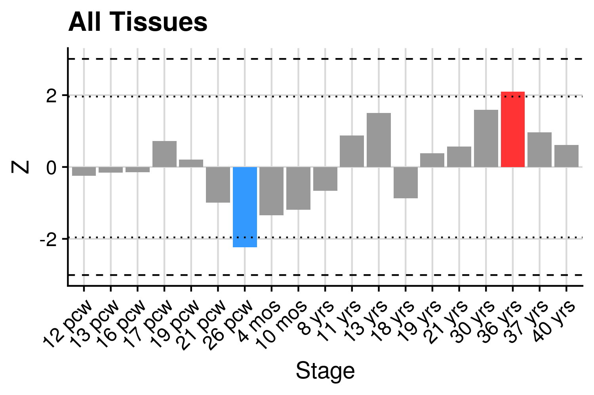

***

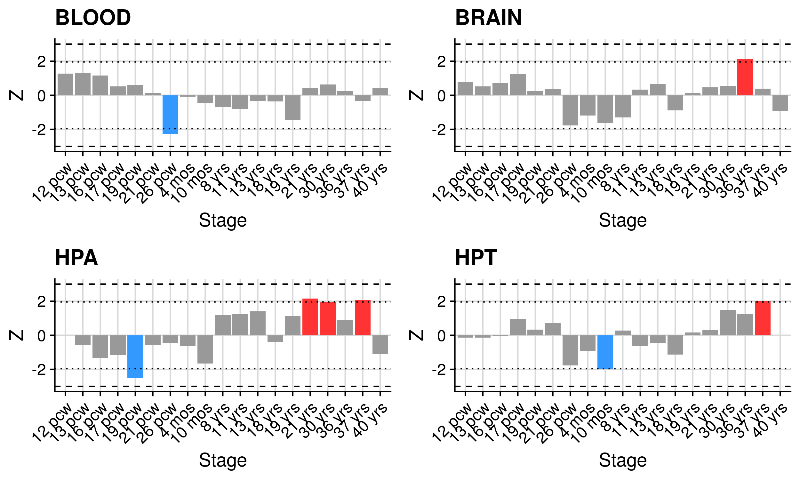

***

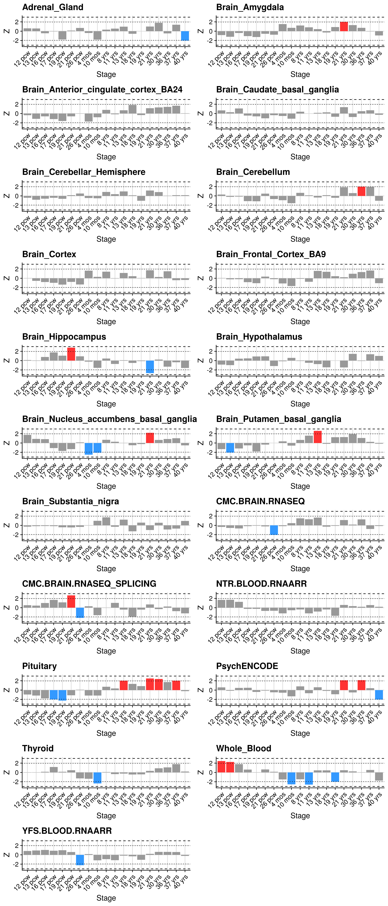
***

\center

</details>

***

# Comparison with previous literature

Results files of the previous studies used for this comparison were obtained from the supplementary tables of each study.

***

## TWAS literature
Our study results were compared with Wray et al. (2018), Gaspar et al. (2019), and Gerring et al. (2019)

<details><summary>Show code</summary>
```{R, eval=F, echo=T}
########################################
# Comparing our results to previous TWASs
###############################################
# our TWAS, Wray et al TWAS, Gaspar et al. TWAS, Gerring et al. (2019)

###
# Load data
###
library(data.table)

#these are all files with significant features only (except for our results)
our_hits <- fread("C:/Users/loryd/Desktop/MSc dissertation/findings/raw findings/AllTissues_CLEAN.txt")
our_hits_sign <- fread("C:/Users/loryd/Desktop/MSc dissertation/findings/raw findings/signtest.AllTissues_CLEAN.txt")
Gaspar_hits <- fread("C:/Users/loryd/Desktop/MSc dissertation/mock data/Gaspar et al. hits.txt")
Wray_hits <- fread("C:/Users/loryd/Desktop/MSc dissertation/mock data/Wray et al. hits.csv")
Gerring_hits <- fread("C:/Users/loryd/Desktop/MSc dissertation/mock data/Gerring et al. hits.csv")

###
# Structure df so that they are similar
###

#1. GASPAR (NB this includes info on TWAS.Z values not p values)
#melt the gaspar hits df so that it presents one column with all SNP-weigths and one with the values
Gaspar_hits2 <- melt(Gaspar_hits, id = c("target", "CHROMOSOME"))
head(Gaspar_hits2)

#rename cols
Gaspar_hits2$PANEL <- Gaspar_hits2$variable
Gaspar_hits2$TWAS.Z <- Gaspar_hits2$value

#2. Wray et al 
#keep panel, ID, and TWAS.P & TWAS.Z info only 
library(tidyverse)
Wray_hits <- as_tibble(Wray_hits)
Wray_hits
Wray_hits_filt <- Wray_hits %>% select("Gene", "CHR", "TWAS.Z", "TWAS.P")

#3. Gerring et al. 
#the gene needs to be called ID so that we can merge based on that. Filter for the columns needed
Gerring_hits$ID <- Gerring_hits$GENE
Gerring_hits <- as_tibble(Gerring_hits)
Gerring_hits_filt <- Gerring_hits %>% select ('ID', 'ZSTAT', 'P')

#ALL
#rename columns so they all correspond 
Wray_hits_filt$ID <- Wray_hits_filt$Gene

#filter our findings for the  cols needed only 
our_hits <- as_tibble(our_hits)
colnames(our_hits)
our_hits_filt <- our_hits %>% select("PANEL", "PANEL_clean_short", "ID", "CHR", "P0", "P1", "TWAS.Z", "TWAS.P")

###
# Fix SNP-weights 
###

###
# Filter our findings for any gene significant in either study 
###
str(our_hits_sign)
sign_genes_our <- our_hits_sign$ID
str(sign_genes_our)
sign_genes_Wray <- Wray_hits_filt$ID
str(sign_genes_Wray)

Gaspar_hits2$ID <- Gaspar_hits2$target
Gaspar_hits2<-Gaspar_hits2[!is.na(Gaspar_hits2$TWAS.Z),]
sign_genes_Gaspar <- Gaspar_hits2$ID
str(sign_genes_Gaspar)

sign_genes_Gerring <- Gerring_hits_filt$ID

Gaspar <- unique(sign_genes_Gaspar) #25 unique genes
Wray <- unique(sign_genes_Wray) #17 unique genes
Us <- unique(sign_genes_our) #91 unique genes 
Gerring <- unique(sign_genes_Gerring) #57 unique genes

#create a general variable with all sign. genes in any paper
All <- c(Gaspar, Wray, Us, Gerring)
All #190 genes - from any of the examined publications (i.e. there might still be some duplicates, across studies)

#keep only unique gene IDs
All_unique <- unique(All)
All_unique #133 unique genes considered as significant across all examined publications 


###
#Keep only genes sign, in either of the three studies
###

#filter by genes which are in the vector containing sign. features in any of the studies
our_hits_final <- our_hits_filt[(our_hits_filt$ID %in% All_unique), ]  #817 observations

#keep only unique genes (those with the greatest absolute z-score)
#to do so, after excluding for missing values, you order genes by z-scores (decreasing order) and keep only unique values
#since you ordered from the largest z-scores, the genes with the largest z-scores will be kept and their duplicates, with lower
# z-scores, discarded. 
our_hits_final<-our_hits_final[!is.na(our_hits_final$TWAS.Z),]
our_hits_final2 <- our_hits_final[order(abs(our_hits_final$TWAS.Z), decreasing = T), ]
library(dplyr)
our_hits_final3  <- our_hits_final2 %>% distinct(ID, .keep_all = T) #125 obs.

our_hits_correct <- our_hits_final3

#keep only unique genes in the Gaspar et al study (different snp-weight sets were tested)
Gaspar_hits2b<-Gaspar_hits2[!is.na(Gaspar_hits2$TWAS.Z),]
Gaspar_hits3 <- Gaspar_hits2b[order(abs(Gaspar_hits2b$TWAS.Z), decreasing = T), ]
Gaspar_hits4  <- Gaspar_hits3 %>% distinct(target, .keep_all = T) #25 gene IDs, as expected 

Gaspar_correct <- Gaspar_hits4

#NB no need to keep only unique genes for the Wray et al TWAS as that is tested in one tissue only
#exclude missings in the Wray et al 
Wray_hits_correct <- Wray_hits_filt[!is.na(Wray_hits_filt$TWAS.Z), ] 
Wray_hits_correct

#keep only unique genes in the Gerring et al. study (different snp-weight sets were tested)
Gerring_hits_filt2<-Gerring_hits_filt[!is.na(Gerring_hits_filt$ZSTAT),]
Gerring_hits_filt3 <- Gerring_hits_filt2[order(abs(Gerring_hits_filt2$ZSTAT), decreasing = T), ]
Gerring_correct <- Gerring_hits_filt3 %>% distinct(ID, .keep_all = T) #57 genes

###
# Change the names of variables which have the same col name but distinct values across the three df
###
Gaspar_correct$Gaspar_TWAS.Z <- Gaspar_correct$TWAS.Z
Gaspar_correct$TWAS.Z <- NULL

Wray_hits_correct$Wray_TWAS.Z <- Wray_hits_correct$TWAS.Z
Wray_hits_correct$TWAS.Z <- NULL

Gerring_correct$Gerring_TWAS.Z <- Gerring_correct$ZSTAT
Gerring_correct$ZSTAT <- NULL

Wray_hits_correct$Wray_TWAS.P <- Wray_hits_correct$TWAS.P
Wray_hits_correct$TWAS.P <- NULL

our_hits_correct$DallAglio_TWAS.Z <- our_hits_correct$TWAS.Z
our_hits_correct$DallAglio_TWAS.P <- our_hits_correct$TWAS.P

our_hits_correct$TWAS.Z <- NULL
our_hits_correct$TWAS.P <- NULL
our_hits_correct$PANEL <- NULL
our_hits_correct$PANEL_clean_short <- NULL


Wray_hits_correct$CHR <- NULL
Wray_hits_correct$Wray_TWAS.P <- NULL
Wray_hits_correct$TWAS.P <- NULL

Gaspar_correct$PANEL <- NULL


###
#join your hits with the hits from the wray et al. paper and Gaspar et al paper
###
#since the three tibbles do not have the same nrow, we cannot use merge. But we can use full_join

Gaspar_correct <- as_tibble(Gaspar_correct) #transform all df into tibbles to use full join. the other 3
##df are already tibbles. this was the only one left to convert


#join hits bw Gaspar and our study
Gaspar_correct$ID <- Gaspar_correct$target
table_correct<- full_join(our_hits_correct, Gaspar_correct) #dim 129, 10

#merge the newly created table with the wray et al findings too
table_correct2 <- full_join(table_correct, Wray_hits_correct)  #dim 129, 11

#merge the newly created table with the Gerring et al. findings
table_correct3 <- full_join(table_correct2, Gerring_correct) #dim 133, 13

#check that no gene is repeated and that z-scores are present for the three studies (should be high z-scores)
table_correct3 <- table_correct3[order(table_correct3$ID), ]


###
# Clean up and save
###

my_data <- as_data_frame(table_correct3)
colnames(my_data)

col_order <- c("ID", "Gaspar_TWAS.Z", "Wray_TWAS.Z", "Gerring_TWAS.Z", "DallAglio_TWAS.Z", "Transcriptome_wide_sign_DallAglio")
my_data2 <- my_data[, col_order]
my_data2


#save as csv file (each df col is treated as independent col, +excel format)
write.csv(my_data2, 'C:/Users/loryd/Desktop/MSc dissertation/findings/table/comparison_previousTWASs.csv', row.names=F)


```
</details>

<details><summary>Show comparison with previous TWAS</summary>
```{R, echo=F, eval=T}
res<-read.csv('/users/k1806347/brc_scratch/Analyses/Lorenza/Clean/Previous_literature/comparison_previousTWASs.csv')

library(knitr)
kable(res, rownames = FALSE, caption='Comparison with previous TWAS', digits = 32)
```

</details>

***

## Observed gene expression TWAS of depression 

<details><summary>Our findings compared to Jansen et al. (2016)</summary>
```{R, eval=F, echo=T}
##################
# Comparing our findings to the findings from Jansen et al. (TWAS of observed gene expression)
##################

###
# Load data
###

library(data.table)
library(dplyr)

our_hits <- fread("/users/k1806347/brc_scratch/Analyses/Lorenza/Clean/TWAS/MDD_TWAS_AllTissues_TWSig_CLEAN.txt")
Jansen_alloutput <- fread("/users/k1806347/brc_scratch/Analyses/Lorenza/Clean/Previous_literature/Jansen\ et\ al.\ hits.csv")
our_alloutput <- fread("/users/k1806347/brc_scratch/Analyses/Lorenza/Clean/TWAS/MDD_TWAS_AllTissues_CLEAN.txt")

#filter for significant features only in the Jansen paper
colnames(Jansen_alloutput)
Jansen_sign <- filter(Jansen_alloutput, Jansen_alloutput$`FDR control vs current`< 0.1) #this is for the Jansenvsour study comparison

#keep only needed columns in both df 
library(tidyverse)
our_hits <- as_tibble(our_hits)
our_hits
our_hits_filt <- our_hits %>% select("ID", "CHR", "P0", "P1", "TWAS.Z", "TWAS.P", "PANEL_clean_short")

###
#Comparing our results vs Jansen et al's 
###
our_hits[order(our_hits$ID), ]
Jansen_alloutput[order(Jansen_alloutput$Gene), ]

table_ourvsJansen2 <- merge(our_hits, Jansen_alloutput, by.x = "ID", by.y = "Gene")

validated <- table_ourvsJansen2[(table_ourvsJansen2$`P control vs current`< 0.05), ]
dim(validated)[1] # 44
#44 features which were significant in our study, were also nominally significant in their study (for either one of the three comparison types)

unique(validated$ID)
#these 44 hits corresponded to 14 unique genes
#[1] "ANKRD44"  "CKB"      "COQ3"     "DLST"     "EP300"    "FLOT1"
#[7] "OSBPL3"   "PCDHA8"   "RAB27B"   "RERE"     "SYNE2"    "TMEM106B"
#[13] "TRMT61A"  "ZSCAN16"

nrow(validated)  #44 rows

###
#create a table comparing our findings to theirs
###

#Order cols as you like
library(tibble)
validated <- as_data_frame(validated)
colnames(validated)

#order the table by CHR and then P0
str(validated)
validated$CHR <- as.numeric(as.character(validated$CHR))
validated$P0 <- as.numeric(as.character(validated$P0))
validated <- validated[order(validated$CHR, validated$P0), ]


#fix columns
validated$Location <- paste0('chr',validated$CHR,':', validated$P0,'-',validated$P1)
validated$DallAglio_Zscore <- validated$TWAS.Z
validated$DallAglio_pvalue <- validated$TWAS.P
validated$Jansen_pvalue_controlsvscurrent <- validated$`P control vs current` 
validated$Jansen_zscore_controlsvscurrent <- validated$`B control vs current`

#set a column order
col_order <- c("Location", "ID", "PANEL_clean_short", "DallAglio_Zscore", "Jansen_zscore_controlsvscurrent", "DallAglio_pvalue", "Jansen_pvalue_controlsvscurrent")

validated <- validated[, col_order]
validated

#add columns with 1) whether assoc. surpass the bonferroni threshold, 2) specifying whether the direction
# of effects is consistent across the two studies

#1) Add the column with surpassing the Bonferroni sign. or not
0.05 / 14    #Bonf. significance = nominal p value / number of unique genes
# = 0.003571429

validated$Bonf_validated <- ifelse(validated$Jansen_pvalue_controlsvscurrent < 0.003571429, "Yes", "No")

#2) add the column specifying whether direction of effects is consistent

validated$Consistent_dir_effect <- ifelse((validated$Jansen_zscore_controlsvscurrent > 0 & validated$DallAglio_Zscore > 0) | (validated$Jansen_zscore_controlsvscurrent < 0 & validated$DallAglio_Zscore <0), "Yes", "No")

sum(validated$Consistent_dir_effect == "Yes")  #16 associations present the same direction of effect
sum(validated$Consistent_dir_effect == "No") #28 associations present a different direction of effect

sum(validated$Bonf_validated == "Yes") #12 associations Bonferroni validated
print(validated$ID[validated$Bonf_validated == "Yes"]) 
#[1] "RERE"     "RERE"     "TMEM106B" "TMEM106B" "TMEM106B" "TMEM106B" "TMEM106B"
#[8] "TMEM106B" "TMEM106B" "TMEM106B" "EP300"    "EP300"

#these 12 validated associations come from 3 unique genes = RERE, TMEM106B, EP300

#change col order again
col_order_2 <- c("Location", "ID", "PANEL_clean_short", "DallAglio_Zscore", "Jansen_zscore_controlsvscurrent", "DallAglio_pvalue", "Jansen_pvalue_controlsvscurrent", "Consistent_dir_effect", "Bonf_validated")

validated <- validated[, col_order_2]
head(validated)

#save as csv file (each df col is treated as independent col, +excel format)
write.csv(validated, '/users/k1806347/brc_scratch/Analyses/Lorenza/Clean/Previous_literature/OurFindingsvsJansen_correct.csv', row.names = F)

validated
```

</details>

<details><summary>Jansen et al. (2016) findings compared to ours</summary>
```{R, eval=F, echo=T}
####
# Comparing the Jansen et al results to ours 
####
#this script is the continuation of the one before

#order both df by gene ID
our_alloutput[order(our_alloutput$ID), ]
Jansen_sign[order(Jansen_sign$Gene), ]

#merge
table_Jansenvsours <- merge(our_alloutput, Jansen_sign, by.x = "ID", by.y = "Gene")

Replicated_byus <- table_Jansenvsours[(table_Jansenvsours$TWAS.P < 0.05), ]
dim(Replicated_byus)[1]
#66 observations

unique(Replicated_byus$ID)
#pertain to 32 IDs:
# [1] "AMICA1"  "ARHGEF7" "ARL4C"   "ASPH"    "CCDC116" "CD47"    "COA1"    "CPEB4"  
# [9] "DDHD1"   "DENND4C" "DYRK2"   "DYSF"    "FBXO3"   "GNPTAB"  "GOT2"    "IL6R"   
#[17] "INVS"    "KTN1"    "MBNL1"   "MEFV"    "MTSS1"   "MYH9"    "NAPG"    "NCALD"  
#[25] "NUPL2"   "OSTM1"   "PAPPA2"  "SP4"     "TGFBR3"  "TMED10"  "TMEM136" "TMEM64"


###
#FIx the table
###

#Order cols as you like
library(tibble)
Replicated_byus <- as_data_frame(Replicated_byus)
colnames(Replicated_byus)

#order the table by CHR and then P0
str(Replicated_byus)
Replicated_byus$CHR <- as.numeric(as.character(Replicated_byus$CHR))
Replicated_byus$P0 <- as.numeric(as.character(Replicated_byus$P0))
Replicated_byus$P1 <- as.numeric(as.character(Replicated_byus$P1))

Replicated_byus <- Replicated_byus[order(Replicated_byus$CHR, Replicated_byus$P0), ]

#fix columns
Replicated_byus$Location <- paste0('chr',Replicated_byus$CHR,':', Replicated_byus$P0,'-',Replicated_byus$P1)
Replicated_byus$DallAglio_Zscore <- Replicated_byus$TWAS.Z
Replicated_byus$DallAglio_pvalue <- Replicated_byus$TWAS.P
Replicated_byus$Jansen_pvalue_controlsvscurrent <- Replicated_byus$`P control vs current` 
Replicated_byus$Jansen_zscore_controlsvscurrent <- Replicated_byus$`B control vs current`

#set a column order
col_order3 <- c("Location", "ID", "PANEL_clean_short", "DallAglio_Zscore", "Jansen_zscore_controlsvscurrent", "DallAglio_pvalue", "Jansen_pvalue_controlsvscurrent")

Replicated_byus <- Replicated_byus[, col_order3]
Replicated_byus

#add columns with 1) whether assoc. surpass the bonferroni threshold, 2) specifying whether the direction
# of effects is consistent across the two studies

#1) Add the column with surpassing the Bonferroni sign. or not
0.05 / 32    #Bonf. significance = nominal p value / number of unique genes
# = 0.0015625

Replicated_byus$Bonf_validated <- ifelse(Replicated_byus$DallAglio_pvalue < 0.0015625, "Yes", "No")

#2) add the column specifying whether direction of effects is consistent

Replicated_byus$Consistent_dir_effect <- ifelse((Replicated_byus$Jansen_zscore_controlsvscurrent > 0 & Replicated_byus$DallAglio_Zscore > 0) | (Replicated_byus$Jansen_zscore_controlsvscurrent < 0 & Replicated_byus$DallAglio_Zscore <0), "Yes", "No")

sum(Replicated_byus$Consistent_dir_effect == "Yes")  #33 associations present the same direction of effect
sum(Replicated_byus$Consistent_dir_effect == "No") #33 associations present a different direction of effect

sum(Replicated_byus$Bonf_validated == "Yes") #11 associations Bonferroni validated
print(Replicated_byus$ID[Replicated_byus$Bonf_validated == "Yes"]) 
#[1] "PAPPA2" "MBNL1"  "TMEM64" "TMEM64" "TMEM64" "TMEM64" "GNPTAB" "KTN1"   "KTN1"  
#[10] "KTN1"   "TMED10"

#these come from 6 unique genes = PAPPA2, MBNL1, TMEM64, GNPTAB, KTN1, TMED10

#change col order again
col_order_3 <- c("Location", "ID", "PANEL_clean_short", "DallAglio_Zscore", "Jansen_zscore_controlsvscurrent", "DallAglio_pvalue", "Jansen_pvalue_controlsvscurrent", "Consistent_dir_effect", "Bonf_validated")

Replicated_byus <- Replicated_byus[, col_order_3]
head(Replicated_byus)

#save as csv file 
write.csv(Replicated_byus, '/users/k1806347/brc_scratch/Analyses/Lorenza/Clean/Previous_literature/Jansenvsourfindings_correct.csv', row.names = F)

Replicated_byus

```
</details>

<details><summary>Show comparison with Jansen et al.</summary>
```{R, echo=F, eval=T}
res<-read.csv('/users/k1806347/brc_scratch/Analyses/Lorenza/Clean/Previous_literature/OurFindingsvsJansen_correct.csv')

library(knitr)
kable(res, rownames = FALSE, caption='Our Findings vs Jansen', digits = 32)

res<-read.csv('/users/k1806347/brc_scratch/Analyses/Lorenza/Clean/Previous_literature/Jansenvsourfindings_correct.csv')

library(knitr)
kable(res, rownames = FALSE, caption='Jansen vs our findings', digits = 32)
```

</details>

***
*Report ended*
